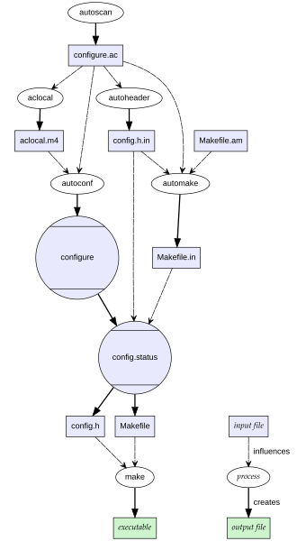

Данный раздел посвящен сборочным зависимостям и инструментам, позволяющим автоматически проводить сборку проекта с использованием параметров, непосредственно влияющих на элементы сборки.

Необходимость инструмента
---

Мы уже обсуждали автоматическую сборку проектов, рассматривали утилиту `make`, как один из проверенных временем инструментов. Однако есть несколько довольно важных аспектов сборки, с которыми `Make` не справляется или делает это очень сложно:
1. ***Опциональная сборка***  — Чтобы сделать возможным сборку с возможностью добавления или отключения какой-то настройки, нужно прописать буквально два различных сценария этой сборки с подключением необходимых настройке ресурсов (библиотек, зависимостей и т. д.) и без него;
2. ***Поиск зависимостей в системе*** — Расположение библиотек, `include`-файлов, используемых утилит в разных системах не унифицировано. А в эзотерических окружениях можно просто не найти нужных зависимостей, все связи приходится настраивать вручную;
3. ***Проверка наличия и работоспособности зависимостей*** — С `make` это тоже ложится на плечи разработчика, поскольку он сам лишь прогоняет прописанные скрипты. В общем, хочешь, чтобы проверяло — напиши это сам;
4. ***Поддержка `workflow` разработки*** — Процесс разработки включает в себя тестирование, документацию, дисциплину оформления и хранения исходников, и всё это тоже не `Make`-а дело;
5. ***Понятный UI*** — При использовании инструмента хочется видеть понятные описания действий, скрывающих под собой командные строки инструментов;

И, кроме указанных, существует ещё множество задач, которые просто не предназначены для `make`. При этом как внутренний инструмент автосборки он работает замечательно. Следовательно, необходим высокоуровневый инструмент с простым интерфейсом, где `Makefile` будет просто одним из генерирующихся под конкретную сборку файлов, а основная параметризация сборки будет происходить уровнем выше

Autotools
---

Для решения наших задач мы будем рассматривать набор инструментов `autotools`, позволяющий автоматически искать, настраивать и параметризировать сборочные зависимости, а также обрабатывать тесты и, в целом, поддерживать рабочее окружение

Работа `autotools` заключается в создании конфигурационных файлов, по которым будет генерироваться наш `Makefile`, будут находиться и подключаться (или отключаться) опциональные зависимости и настраиваться параметры сборки.

#### Первая сборка

Рассмотрим [пример](https://git.sr.ht/~frbrgeorge/AutotoolsExample/log), иллюстрирующий настройку сборочных зависимостей при помощи `autotools`, и на нём разберёмся с основными утилитами набора.

Изначально имеем просто нашу программу, которая при помощи библиотеки `ncurses` читает и выводит на экран коды символов. 
```console
stephen@localhost:~/LinuxAppDev/07_Enviromental/Lection/AutotoolsExample> tree -l
.
├── src
    └── key.c

1 directory, 1 file
stephen@localhost:~/LinuxAppDev/07_Enviromental/Lection/AutotoolsExample> 
```

`key.c`
```c
#include <ncurses.h>
#include <unistd.h>
#include <error.h>

#ifndef DX
#define DX 3
#endif

int main(void) {
        WINDOW *win;
        int c = 0;

        if (!isatty(0))
                error(1, 0, "Not a terminal");
        initscr();
        noecho();
        cbreak();
        refresh();

        win = newwin(LINES-2*DX, COLS-2*DX, DX, DX);
#ifdef KEYPAD
        keypad(win, TRUE);
#else
        keypad(win, FALSE);
#endif
        scrollok (win, TRUE);
        do {
                wprintw(win, "  Key: %d, Name: %s\n", c, keyname(c));
                box(win, 0, 0);
                wrefresh(win);
        } while((c = wgetch(win)) != 27);

        endwin();
	return 0;
}
```

	Как можно заметить, в программе есть два `define`: на режим `keypad` и размер рамки

Для создания конфигурационного файла можно воспользоваться первым инструментом `autotools` — `autoscan`. Эта утилита сканирует заданную директорию проекта и создаёт профиль конфигураций — файл `configure.scan`, в котором добавлены объекты и зависимости, которые, скорее всего, присутствуют в сборочных зависимостях 

```console
stephen@localhost:~/LinuxAppDev/07_Enviromental/Lection/AutotoolsExample> ls
src
stephen@localhost:~/LinuxAppDev/07_Enviromental/Lection/AutotoolsExample> autoscan .
stephen@localhost:~/LinuxAppDev/07_Enviromental/Lection/AutotoolsExample> ls
autoscan.log  configure.scan  src
stephen@localhost:~/LinuxAppDev/07_Enviromental/Lection/AutotoolsExample> subl configure.scan 
stephen@localhost:~/LinuxAppDev/07_Enviromental/Lection/AutotoolsExample> 
```

```sh
#                                               -*- Autoconf -*-
# Process this file with autoconf to produce a configure script.

AC_PREREQ([2.72])
AC_INIT([FULL-PACKAGE-NAME], [VERSION], [BUG-REPORT-ADDRESS])
AC_CONFIG_SRCDIR([src/key.c])
AC_CONFIG_HEADERS([config.h])

# Checks for programs.
AC_PROG_CC

# Checks for libraries.

# Checks for header files.
AC_CHECK_HEADERS([unistd.h])

# Checks for typedefs, structures, and compiler characteristics.

# Checks for library functions.
AC_FUNC_ERROR_AT_LINE

AC_CONFIG_FILES([Makefile])
AC_OUTPUT

```

Непосредственно файл конфигураций называется `configure.ac`. Переименуем наш генерат и отредактируем его: пока что изменим просто инициализирующий макрос `AC_INIT`, а также закомментируем `AC_CONFIG_HEADERS` и `AC_CONFIG_FILES`, мы вернёмся к ним позже.

```sh
#                                               -*- Autoconf -*-
# Process this file with autoconf to produce a configure script.

AC_PREREQ([2.72])
AC_INIT([Key scanner], [0.0], [Stephen])
AC_CONFIG_SRCDIR([src/key.c])
# AC_CONFIG_HEADERS([config.h])

# Checks for programs.
AC_PROG_CC

# Checks for libraries.

# Checks for header files.
AC_CHECK_HEADERS([unistd.h])

# Checks for typedefs, structures, and compiler characteristics.

# Checks for library functions.
AC_FUNC_ERROR_AT_LINE

# AC_CONFIG_FILES([Makefile])
AC_OUTPUT
```

Посмотрим, что в таком скелетном формате сможет сделать `autotools`. 

Запустим следующую утилиту набора — `autoconf`, которая генерирует shell-скрипт с описанием всех зависимостей, и опциональных параметров, которые мы указали в исходнике. 

```console
stephen@localhost:~/LinuxAppDev/07_Enviromental/Lection/AutotoolsExample> autoconf
stephen@localhost:~/LinuxAppDev/07_Enviromental/Lection/AutotoolsExample> ls
autom4te.cache  configure  configure.ac src
stephen@localhost:~/LinuxAppDev/07_Enviromental/Lection/AutotoolsExample>
```

Посмотрим, что из себя представляет `configure`:
```sh
#! /bin/sh
# Guess values for system-dependent variables and create Makefiles.
# Generated by GNU Autoconf 2.72 for Key logger 0.0.
#
# Report bugs to <Stephen>.

<...>

# Be more Bourne compatible
DUALCASE=1; export DUALCASE # for MKS sh
if test ${ZSH_VERSION+y} && (emulate sh) >/dev/null 2>&1
then :
  emulate sh
  NULLCMD=:
  # Pre-4.2 versions of Zsh do word splitting on ${1+"$@"}, which
  # is contrary to our usage.  Disable this feature.
  alias -g '${1+"$@"}'='"$@"'
  setopt NO_GLOB_SUBST
else case e in #(
  e) case `(set -o) 2>/dev/null` in #(
  *posix*) :
    set -o posix ;; #(
  *) :
     ;;
esac ;;
esac
fi

<...>

if test -n "$ac_unrecognized_opts" && test "$enable_option_checking" != no; then
  { printf "%s\n" "$as_me:${as_lineno-$LINENO}: WARNING: unrecognized options: $ac_unrecognized_opts" >&5
printf "%s\n" "$as_me: WARNING: unrecognized options: $ac_unrecognized_opts" >&2;}
fi
```

Хм, много каких-то операторов в скрипте. А насколько много?

```console
stephen@localhost:~/LinuxAppDev/07_Enviromental/Lection/AutotoolsExample> wc configure
  4080  15359 117468 configure
stephen@localhost:~/LinuxAppDev/07_Enviromental/Lection/AutotoolsExample> 
```

Вот это да! Мы ещё не внесли никаких ключевых параметров в генерацию, а нам уже создался огромный скрипт, проверяющий все ключевые библиотеки, их работоспособность и используемость 

Попробуем теперь запустить наш конфигурационный файл

```console
stephen@localhost:~/LinuxAppDev/07_Enviromental/Lection/AutotoolsExample> autoconf 
stephen@localhost:~/LinuxAppDev/07_Enviromental/Lection/AutotoolsExample> ls
autom4te.cache  autoscan.log  configure  configure.ac  src
stephen@localhost:~/LinuxAppDev/07_Enviromental/Lection/AutotoolsExample> ./configure 
configure: loading site script /usr/share/site/x86_64-pc-linux-gnu
checking for gcc... gcc
checking whether the C compiler works... yes
checking for C compiler default output file name... a.out
checking for suffix of executables... 
checking whether we are cross compiling... no
checking for suffix of object files... o
checking whether the compiler supports GNU C... yes
checking whether gcc accepts -g... yes
checking for gcc option to enable C11 features... none needed
checking for stdio.h... yes
checking for stdlib.h... yes
checking for string.h... yes
checking for inttypes.h... yes
checking for stdint.h... yes
checking for strings.h... yes
checking for sys/stat.h... yes
checking for sys/types.h... yes
checking for unistd.h... yes
checking for unistd.h... (cached) yes
checking for error_at_line... yes
configure: creating ./config.status
stephen@localhost:~/LinuxAppDev/07_Enviromental/Lection/AutotoolsExample> ls
autom4te.cache  config.log     configure     src
autoscan.log    config.status  configure.ac
stephen@localhost:~/LinuxAppDev/07_Enviromental/Lection/AutotoolsExample> 
```

Как видим, у нас идёт проверка наличия и работоспособности компилятора, библиотек, а также создаётся файл `config.status`, который является как бы срезом файла `configure` с уже выбранными опциями сборки, предназначенный для пересборки проекта с теми же параметрами.

#### Добавление зависимостей

Как было видно из `configure.ac`, наш конфигурационный файл не ищет (и, соответственно, не добавляет в сборочную зависимость) библиотеку `ncurses`. Давайте добавим это в нашу конфигурацию.
Для этого воспользуемся макросом `AC_CHECK_HEADERS` для проверки наличия заголовка нашей библиотеки в проекте, а также макросом `AC_CHECK_LIB`, который генерирует временный файл с текстовым кодом, использующим указанную нами функцию исследуемой библиотеки. При удачной компиляции настройки для использования библиотеки в проекте будут добавлены в `config.status`

```sh
#                                               -*- Autoconf -*-
# Process this file with autoconf to produce a configure script.

AC_PREREQ([2.72])
AC_INIT([Key scanner], [0.0], [Stephen])
AC_CONFIG_SRCDIR([src/key.c])
# AC_CONFIG_HEADERS([config.h])

# Checks for programs.
AC_PROG_CC

# Checks for libraries.
AC_CHECK_LIB([ncursesw],[initscr],[],[AC_MSG_ERROR([Curses is needed])])
AC_CHECK_LIB([optional],[completely_lost]) #заодно проверим библиотеку optional

# Checks for header files.
AC_CHECK_HEADERS([unistd.h])
AC_CHECK_HEADERS([ncurses.h])

# Checks for typedefs, structures, and compiler characteristics.

# Checks for library functions.
AC_FUNC_ERROR_AT_LINE

# AC_CONFIG_FILES([Makefile])
AC_OUTPUT

```

```console
stephen@localhost:~/LinuxAppDev/07_Enviromental/Lection/AutotoolsExample> autoconf
stephen@localhost:~/LinuxAppDev/07_Enviromental/Lection/AutotoolsExample> ls
autom4te.cache  configure  configure.ac  src
stephen@localhost:~/LinuxAppDev/07_Enviromental/Lection/AutotoolsExample> ./configure 
configure: loading site script /usr/share/site/x86_64-pc-linux-gnu
checking for gcc... gcc
checking whether the C compiler works... yes
checking for C compiler default output file name... a.out
checking for suffix of executables... 
checking whether we are cross compiling... no
checking for suffix of object files... o
checking whether the compiler supports GNU C... yes
checking whether gcc accepts -g... yes
checking for gcc option to enable C11 features... none needed
checking for initscr in -lncursesw... yes # нашёл функцию в библиотеке
checking for completely_lost in -loptional... no # А это имя не нашёл
checking for stdio.h... yes
checking for stdlib.h... yes
checking for string.h... yes
checking for inttypes.h... yes
checking for stdint.h... yes
checking for strings.h... yes
checking for sys/stat.h... yes
checking for sys/types.h... yes
checking for unistd.h... yes
checking for unistd.h... (cached) yes
checking for ncurses.h... yes
checking for error_at_line... yes
configure: creating ./config.status
stephen@localhost:~/LinuxAppDev/07_Enviromental/Lection/AutotoolsExample> 
```

#### Макросы конфигурации

Рассмотрим следующий инструмент `autotools` — `autoheader`. Он на основе нашего конфигурационного шаблона собирает заголовочный файл `config.h`, в котором хранятся макросы конфигурации проекта — пути к библиотекам, включения определённых функций, дополнительные переменные окружения и другие настройки

Для начала просто просто раскомментируем строку с макросом `AC_CONFIG_HEADERS` в `confinure.ac`

```sh
#                                               -*- Autoconf -*-
# Process this file with autoconf to produce a configure script.

AC_PREREQ([2.72])
AC_INIT([Key scanner], [0.0], [Stephen])
AC_CONFIG_SRCDIR([src/key.c])
AC_CONFIG_HEADERS([config.h])

# Checks for programs.
AC_PROG_CC

# Checks for libraries.
AC_CHECK_LIB([ncursesw],[initscr],[],[AC_MSG_ERROR([Curses is needed])])
AC_CHECK_LIB([optional],[completely_lost])

# Checks for header files.
AC_CHECK_HEADERS([unistd.h])
AC_CHECK_HEADERS([ncurses.h])

# Checks for typedefs, structures, and compiler characteristics.

# Checks for library functions.
AC_FUNC_ERROR_AT_LINE

# AC_CONFIG_FILES([Makefile])
AC_OUTPUT

```

```console
stephen@localhost:~/LinuxAppDev/07_Enviromental/Lection/AutotoolsExample> autoconf
stephen@localhost:~/LinuxAppDev/07_Enviromental/Lection/AutotoolsExample> ./configure
configure: loading site script /usr/share/site/x86_64-pc-linux-gnu
checking for gcc... gcc
checking whether the C compiler works... yes
checking for C compiler default output file name... a.out
checking for suffix of executables... 
checking whether we are cross compiling... no
checking for suffix of object files... o
checking whether the compiler supports GNU C... yes
checking whether gcc accepts -g... yes
checking for gcc option to enable C11 features... none needed
checking for initscr in -lncursesw... yes
checking for completely_lost in -loptional... no
checking for stdio.h... yes
checking for stdlib.h... yes
checking for string.h... yes
checking for inttypes.h... yes
checking for stdint.h... yes
checking for strings.h... yes
checking for sys/stat.h... yes
checking for sys/types.h... yes
checking for unistd.h... yes
checking for unistd.h... (cached) yes
checking for ncurses.h... yes
checking for error_at_line... yes
configure: creating ./config.status
config.status: error: cannot find input file: 'config.h.in' # не нашёл
stephen@localhost:~/LinuxAppDev/07_Enviromental/Lection/AutotoolsExample> 
```

Запустим `autoheader`

```console
stephen@localhost:~/LinuxAppDev/07_Enviromental/Lection/AutotoolsExample> autoheader
stephen@localhost:~/LinuxAppDev/07_Enviromental/Lection/AutotoolsExample> ls
autom4te.cache  config.log     configure   configure.ac
config.h.in     config.status  configure~  src
```

Получили шаблонный файл `config.h.in`, в котором указаны макросы, определённые по `configure.ac`

```
stephen@localhost:~/LinuxAppDev/07_Enviromental/Lection/AutotoolsExample> cat config.h.in
/* config.h.in.  Generated from configure.ac by autoheader.  */

/* Define to 1 if you have the <inttypes.h> header file. */
#undef HAVE_INTTYPES_H

/* Define to 1 if you have the 'ncursesw' library (-lncursesw). */
#undef HAVE_LIBNCURSESW

/* Define to 1 if you have the 'optional' library (-loptional). */
#undef HAVE_LIBOPTIONAL

/* Define to 1 if you have the <ncurses.h> header file. */
#undef HAVE_NCURSES_H

/* Define to 1 if you have the <stdint.h> header file. */
#undef HAVE_STDINT_H

/* Define to 1 if you have the <stdio.h> header file. */
#undef HAVE_STDIO_H

/* Define to 1 if you have the <stdlib.h> header file. */
#undef HAVE_STDLIB_H

/* Define to 1 if you have the <strings.h> header file. */
#undef HAVE_STRINGS_H

/* Define to 1 if you have the <string.h> header file. */
#undef HAVE_STRING_H

/* Define to 1 if you have the <sys/stat.h> header file. */
#undef HAVE_SYS_STAT_H

/* Define to 1 if you have the <sys/types.h> header file. */
#undef HAVE_SYS_TYPES_H

/* Define to 1 if you have the <unistd.h> header file. */
#undef HAVE_UNISTD_H

/* Define to the address where bug reports for this package should be sent. */
#undef PACKAGE_BUGREPORT

/* Define to the full name of this package. */
#undef PACKAGE_NAME

/* Define to the full name and version of this package. */
#undef PACKAGE_STRING

/* Define to the one symbol short name of this package. */
#undef PACKAGE_TARNAME

/* Define to the home page for this package. */
#undef PACKAGE_URL

/* Define to the version of this package. */
#undef PACKAGE_VERSION

/* Define to 1 if all of the C89 standard headers exist (not just the ones
   required in a freestanding environment). This macro is provided for
   backward compatibility; new code need not use it. */
#undef STDC_HEADERS
stephen@localhost:~/LinuxAppDev/07_Enviromental/Lection/AutotoolsExample> 
```

Попробуем теперь снова провести конфигурацию проекта:

```console
stephen@localhost:~/LinuxAppDev/07_Enviromental/Lection/AutotoolsExample> ./configure
configure: loading site script /usr/share/site/x86_64-pc-linux-gnu
checking for gcc... gcc
checking whether the C compiler works... yes
checking for C compiler default output file name... a.out
checking for suffix of executables... 
checking whether we are cross compiling... no
checking for suffix of object files... o
checking whether the compiler supports GNU C... yes
checking whether gcc accepts -g... yes
checking for gcc option to enable C11 features... none needed
checking for initscr in -lncursesw... yes
checking for completely_lost in -loptional... no
checking for stdio.h... yes
checking for stdlib.h... yes
checking for string.h... yes
checking for inttypes.h... yes
checking for stdint.h... yes
checking for strings.h... yes
checking for sys/stat.h... yes
checking for sys/types.h... yes
checking for unistd.h... yes
checking for unistd.h... (cached) yes
checking for ncurses.h... yes
checking for error_at_line... yes
configure: creating ./config.status
config.status: creating config.h # нашёл
stephen@localhost:~/LinuxAppDev/07_Enviromental/Lection/AutotoolsExample> 
```

В процессе конфигурации по in-файлу собрался просто заголовочный файл `config.h`. Посмотрим на него:

```sh
/* config.h.  Generated from config.h.in by configure.  */
/* config.h.in.  Generated from configure.ac by autoheader.  */

/* Define to 1 if you have the <inttypes.h> header file. */
#define HAVE_INTTYPES_H 1

/* Define to 1 if you have the 'ncursesw' library (-lncursesw). */
#define HAVE_LIBNCURSESW 1

/* Define to 1 if you have the 'optional' library (-loptional). */
/* #undef HAVE_LIBOPTIONAL */

/* Define to 1 if you have the <ncurses.h> header file. */
#define HAVE_NCURSES_H 1

/* Define to 1 if you have the <stdint.h> header file. */
#define HAVE_STDINT_H 1

/* Define to 1 if you have the <stdio.h> header file. */
#define HAVE_STDIO_H 1

/* Define to 1 if you have the <stdlib.h> header file. */
#define HAVE_STDLIB_H 1

/* Define to 1 if you have the <strings.h> header file. */
#define HAVE_STRINGS_H 1

/* Define to 1 if you have the <string.h> header file. */
#define HAVE_STRING_H 1

/* Define to 1 if you have the <sys/stat.h> header file. */
#define HAVE_SYS_STAT_H 1

/* Define to 1 if you have the <sys/types.h> header file. */
#define HAVE_SYS_TYPES_H 1

/* Define to 1 if you have the <unistd.h> header file. */
#define HAVE_UNISTD_H 1

/* Define to the address where bug reports for this package should be sent. */
#define PACKAGE_BUGREPORT "Stephen"

/* Define to the full name of this package. */
#define PACKAGE_NAME "Key logger"

/* Define to the full name and version of this package. */
#define PACKAGE_STRING "Key logger 0.0"

/* Define to the one symbol short name of this package. */
#define PACKAGE_TARNAME "key-logger"

/* Define to the home page for this package. */
#define PACKAGE_URL ""

/* Define to the version of this package. */
#define PACKAGE_VERSION "0.0"

/* Define to 1 if all of the C89 standard headers exist (not just the ones
   required in a freestanding environment). This macro is provided for
   backward compatibility; new code need not use it. */
#define STDC_HEADERS 1
```

Заметим, что он заполнился нашими данными, отметил библиотеки и заголовочные файлы, а также исключил макрос, отвечающий за несуществующую у нас библиотеку `optional`.

Теперь можно попробовать добавить наш заголовочный файл в программу и скомпилировать и запустить её. А чтобы проверить, что файл монтируется в программу, будем выводить пару значений из его макросов.

`key.c`
```c
#include <ncurses.h>
#include <unistd.h>
#include <error.h>
#include "config.h"

#ifndef DX
#define DX 3
#endif

int main(void) {
        WINDOW *win;
        int c = 0;

        if (!isatty(0))
                error(1, 0, "Not a terminal");
        initscr();
        noecho();
        cbreak();
        printw("%s (%s)", PACKAGE_STRING, PACKAGE_BUGREPORT);
        refresh();

        win = newwin(LINES-2*DX, COLS-2*DX, DX, DX);
#ifdef KEYPAD
        keypad(win, TRUE);
#else
        keypad(win, FALSE);
#endif
        scrollok (win, TRUE);
        do {
                wprintw(win, "  Key: %d, Name: %s\n", c, keyname(c));
                box(win, 0, 0);
                wrefresh(win);
        } while((c = wgetch(win)) != 27);

        endwin();
	return 0;
}

```

```console
stephen@localhost:~/LinuxAppDev/07_Enviromental/Lection/AutotoolsExample> cc -DKEPAD -I. src/key.c  -lncursesw -o key
stephen@localhost:~/LinuxAppDev/07_Enviromental/Lection/AutotoolsExample> ./key 
```

#### Ключи конфигурации

Научимся передавать внутрь `config.h` наши собственные переменные с помощью ключей конфигурации. Для этого добавим специальный макрос `AC_ARG_ENABLE`, в котором описывается как название ключа, так и связанный с ним макрос, который будет добавлен в `config.h`

```confugire.ac
#                                               -*- Autoconf -*-
# Process this file with autoconf to produce a configure script.

AC_PREREQ([2.72])
AC_INIT([Key logger], [0.0], [Stephen])
AC_CONFIG_SRCDIR([src/key.c])
AC_CONFIG_HEADERS([config.h])

# Checks for programs.
AC_PROG_CC

# Checks for libraries.
AC_CHECK_LIB([ncursesw],[initscr],[],[AC_MSG_ERROR([Curses is needed])])
AC_CHECK_LIB([optional],[completely_lost])

# Checks for header files.
AC_CHECK_HEADERS([unistd.h])
AC_CHECK_HEADERS([ncurses.h])

# Optional clues # добавили новые ключи
AC_ARG_ENABLE([keypad],
    AS_HELP_STRING([--enable-keypad], [Enable input ESC-sequences recognition]),
    AC_DEFINE(KEYPAD,[],[ESC-sequences recognition])
  )

AC_ARG_ENABLE([frame],
    AS_HELP_STRING([--enable-frame=width], [Define frame width]),
    AC_DEFINE_UNQUOTED(DX,[$enable_frame],[Frame width])
  )

# Checks for typedefs, structures, and compiler characteristics.

# Checks for library functions.
AC_FUNC_ERROR_AT_LINE

# AC_CONFIG_FILES([Makefile])
AC_OUTPUT

```

Мы добавили два ключа: `--enable-keypad` позволит вводить `EscSeq` и распознавать их,  `--enable-frame=width` будет задавать ширину рамки окна. 
Таким образом, мы сможем при сборке программы передать ей те самые два условных макроса, которые у нас проверяются в программе.

Попробуем собрать конфигурацию и посмотреть, что поменяется в заголовочном файле

```console
stephen@localhost:~/LinuxAppDev/07_Enviromental/Lection/AutotoolsExample> autoheader
stephen@localhost:~/LinuxAppDev/07_Enviromental/Lection/AutotoolsExample> autoconf
stephen@localhost:~/LinuxAppDev/07_Enviromental/Lection/AutotoolsExample> ./configure
configure: loading site script /usr/share/site/x86_64-pc-linux-gnu
checking for gcc... gcc
checking whether the C compiler works... yes
checking for C compiler default output file name... a.out
checking for suffix of executables... 
checking whether we are cross compiling... no
checking for suffix of object files... o
checking whether the compiler supports GNU C... yes
checking whether gcc accepts -g... yes
checking for gcc option to enable C11 features... none needed
checking for initscr in -lncursesw... yes
checking for completely_lost in -loptional... no
checking for stdio.h... yes
checking for stdlib.h... yes
checking for string.h... yes
checking for inttypes.h... yes
checking for stdint.h... yes
checking for strings.h... yes
checking for sys/stat.h... yes
checking for sys/types.h... yes
checking for unistd.h... yes
checking for unistd.h... (cached) yes
checking for ncurses.h... yes
checking for error_at_line... yes
configure: creating ./config.status
config.status: creating config.h
```

Во-первых, в документации к нашему файлу конфигураций появились указанные ключи:

```console
stephen@localhost:~/LinuxAppDev/07_Enviromental/Lection/AutotoolsExample> ./configure --help
'configure' configures Key logger 0.0 to adapt to many kinds of systems.

Usage: ./configure [OPTION]... [VAR=VALUE]...

<...>

Optional Features:
  --disable-option-checking  ignore unrecognized --enable/--with options
  --disable-FEATURE       do not include FEATURE (same as --enable-FEATURE=no)
  --enable-FEATURE[=ARG]  include FEATURE [ARG=yes]
  --enable-keypad         Enable input ESC-sequences recognition
  --enable-frame=width    Define frame width

<...>

Report bugs to <Stephen>.
stephen@localhost:~/LinuxAppDev/07_Enviromental/Lection/AutotoolsExample> 
```

Во-вторых, в `config.h.in` появились упоминания наших макросов:

```sh
<...>

/* Frame width */
#undef DX

<...>

/* ESC-sequences recognition */
#undef KEYPAD

<...>
```

Совершим конфигурацию с ключами и посмотрим на заголовочный файл:

```console
stephen@localhost:~/LinuxAppDev/07_Enviromental/Lection/AutotoolsExample> ./configure --enable-frame=7 --enable-keypad 
configure: loading site script /usr/share/site/x86_64-pc-linux-gnu
checking for gcc... gcc
checking whether the C compiler works... yes
checking for C compiler default output file name... a.out
checking for suffix of executables... 
checking whether we are cross compiling... no
checking for suffix of object files... o
checking whether the compiler supports GNU C... yes
checking whether gcc accepts -g... yes
checking for gcc option to enable C11 features... none needed
checking for initscr in -lncursesw... yes
checking for completely_lost in -loptional... no
checking for stdio.h... yes
checking for stdlib.h... yes
checking for string.h... yes
checking for inttypes.h... yes
checking for stdint.h... yes
checking for strings.h... yes
checking for sys/stat.h... yes
checking for sys/types.h... yes
checking for unistd.h... yes
checking for unistd.h... (cached) yes
checking for ncurses.h... yes
checking for error_at_line... yes
configure: creating ./config.status
config.status: creating config.h
stephen@localhost:~/LinuxAppDev/07_Enviromental/Lection/AutotoolsExample>
```

`config.h`
```sh
<...>

/* Frame width */
#define DX 7

<...>

/* ESC-sequences recognition */
#define KEYPAD /**/

<...>
```

Данные передались в наш `config.h` и могут использоваться в программе

#### Авто-автосборка

Все предыдущие шаги были направлены на подготовку заголовочных файлов и окружения для работы программы, однако самого взаимодействия с программой (кроме её сканирования для поиска зависимостей) ещё не происходило. Самое время это исправить!

Займёмся написанием автоматического `Makefile` для нашего проекта. Для этого в `autotools` есть два инструмента: `aclocal` аккумулирует в `aclocal.m4` все локальные макросы для сборки, а `automake` из нашего шаблонного файла сгенерирует конкретный `Makefile`. 

Напишем шаблонный `Makefile`-генератор, где укажем основные параметры, которые необходимы нам для сборки: флаги компиляции, названия исходников и исполняемого файла

`Makefile.am`
```make
CFLAGS = -Wall -O0 -g

bin_PROGRAMS=key

key_SOURCES=src/key.c

gitclean:
	git clean -df
```

Также в шаблоне конфигураций укажем генерацию `Makefile`

```configure.ac
#                                               -*- Autoconf -*-
# Process this file with autoconf to produce a configure script.

AC_PREREQ([2.72])
AC_INIT([Key logger], [0.0], [Stephen])
AC_CONFIG_SRCDIR([src/key.c])
AM_INIT_AUTOMAKE([foreign subdir-objects]) # Добавили
AC_CONFIG_HEADERS([config.h])

# Checks for programs.
AC_PROG_CC

# Checks for libraries.
AC_CHECK_LIB([ncursesw],[initscr],[],[AC_MSG_ERROR([Curses is needed])])
AC_CHECK_LIB([optional],[completely_lost])

# Checks for header files.
AC_CHECK_HEADERS([unistd.h])
AC_CHECK_HEADERS([ncurses.h])

# Optional clues
AC_ARG_ENABLE([keypad],
    AS_HELP_STRING([--enable-keypad], [Enable input ESC-sequences recognition]),
    AC_DEFINE(KEYPAD,[],[ESC-sequences recognition])
  )

AC_ARG_ENABLE([frame],
    AS_HELP_STRING([--enable-frame=width], [Define frame width]),
    AC_DEFINE_UNQUOTED(DX,[$enable_frame],[Frame width])
  )

# Checks for typedefs, structures, and compiler characteristics.

# Checks for library functions.
AC_FUNC_ERROR_AT_LINE

AC_CONFIG_FILES([Makefile]) # Добавили
AC_OUTPUT

```

Соберём проект с использованием новых инструментов. При этом для `automake` используем ключ `--add-missing`, с которым утилита автоматически устанавливает необходимые для работы исполняемые файлы

```console
stephen@localhost:~/LinuxAppDev/07_Enviromental/Lection/AutotoolsExample> aclocal
stephen@localhost:~/LinuxAppDev/07_Enviromental/Lection/AutotoolsExample> autoheader
stephen@localhost:~/LinuxAppDev/07_Enviromental/Lection/AutotoolsExample> autoconf
stephen@localhost:~/LinuxAppDev/07_Enviromental/Lection/AutotoolsExample> automake --add-missing
configure.ac:11: installing './compile'
configure.ac:7: installing './install-sh'
configure.ac:7: installing './missing'
Makefile.am: installing './depcomp'
stephen@localhost:~/LinuxAppDev/07_Enviromental/Lection/AutotoolsExample> ls
aclocal.m4      config.h.in   depcomp     Makefile.am  src
autom4te.cache  configure     install-sh  Makefile.in
compile         configure.ac  LICENSE     missing
stephen@localhost:~/LinuxAppDev/07_Enviromental/Lection/AutotoolsExample> 
```

Наряду с `config.h.in` мы получили `in`-файл для автосборки — `Makefile.in`, в котором написан шаблон итогового `make`-а.
Сконфигурируем наш проект

```console
stephen@localhost:~/LinuxAppDev/07_Enviromental/Lection/AutotoolsExample> ./configure --enable-frame=7 --enable-keypad 
configure: loading site script /usr/share/site/x86_64-pc-linux-gnu
checking for a BSD-compatible install... /usr/bin/install -c
checking whether sleep supports fractional seconds... yes
checking filesystem timestamp resolution... 0.01
checking whether build environment is sane... yes
checking for a race-free mkdir -p... /usr/bin/mkdir -p
checking for gawk... gawk
checking whether make sets $(MAKE)... yes
checking whether make supports nested variables... yes
checking xargs -n works... yes
checking for gcc... gcc
checking whether the C compiler works... yes
checking for C compiler default output file name... a.out
checking for suffix of executables... 
checking whether we are cross compiling... no
checking for suffix of object files... o
checking whether the compiler supports GNU C... yes
checking whether gcc accepts -g... yes
checking for gcc option to enable C11 features... none needed
checking whether gcc understands -c and -o together... yes
checking whether make supports the include directive... yes (GNU style)
checking dependency style of gcc... gcc3
checking for initscr in -lncursesw... yes
checking for completely_lost in -loptional... no
checking for stdio.h... yes
checking for stdlib.h... yes
checking for string.h... yes
checking for inttypes.h... yes
checking for stdint.h... yes
checking for strings.h... yes
checking for sys/stat.h... yes
checking for sys/types.h... yes
checking for unistd.h... yes
checking for unistd.h... (cached) yes
checking for ncurses.h... yes
checking for error_at_line... yes
checking that generated files are newer than configure... done
configure: creating ./config.status
config.status: creating Makefile # У нас создался Makefile
config.status: creating config.h
config.status: executing depfiles commands
stephen@localhost:~/LinuxAppDev/07_Enviromental/Lection/AutotoolsExample> 
```

```console
stephen@localhost:~/LinuxAppDev/07_Enviromental/Lection/AutotoolsExample> wc Makefile
  793  2965 25349 Makefile
stephen@localhost:~/LinuxAppDev/07_Enviromental/Lection/AutotoolsExample> 
```

Ничего такой Мейкфайл на 800 строк! Зато он полностью описывает все зависимости и проводит полную сборку нашего проекта.

```console
stephen@localhost:~/LinuxAppDev/07_Enviromental/Lection/AutotoolsExample> make
make  all-am
make[1]: Entering directory '/home/stephen/LinuxAppDev/07_Enviromental/Lection/AutotoolsExample'
depbase=`echo src/key.o | sed 's|[^/]*$|.deps/&|;s|\.o$||'`;\
gcc -DHAVE_CONFIG_H -I.     -Wall -O0 -g -MT src/key.o -MD -MP -MF $depbase.Tpo -c -o src/key.o src/key.c &&\
mv -f $depbase.Tpo $depbase.Po
gcc  -Wall -O0 -g   -o key src/key.o  -lncursesw 
make[1]: Leaving directory '/home/stephen/LinuxAppDev/07_Enviromental/Lection/AutotoolsExample'
stephen@localhost:~/LinuxAppDev/07_Enviromental/Lection/AutotoolsExample> 
```


---
##### Лирическое отступление про `autoreconf`

Описание конфигураций окружения и подготовка генерации `Makelife` входят в основной трек использования `autotools`. И, конечно, среди утилит этого набора есть инструмент, объединяющий весь трек — `autoreconf`, просто вызывающий все инструменты по очереди с заданными параметрами.

 Весь путь по созданию конфигурационного окружения показан здесь:
 

---

Наш `Makefile` хранит множество целей для сборки и проверки работоспособности программы и её компонентов. Для тестирования программы цель тоже есть, называется
`check`. Сейчас она пустая, так как мы не предусмотрели тесты. Добавим их, для этого в `Makefile.am` укажем соответствующий макрос и его описание:

```Makefile.am
CFLAGS = -Wall -O0 -g

bin_PROGRAMS=key

key_SOURCES=src/key.c

TESTS=isterm.sh

isterm.sh:
	echo 'test "`./key < /dev/null 2>&1`" = "./key: Not a terminal"' > $@
	chmod +x $@

gitclean:
	git clean -df
```

```console
stephen@localhost:~/LinuxAppDev/07_Enviromental/Lection/AutotoolsExample> autoreconf -fisv
autoreconf: export WARNINGS=
autoreconf: Entering directory '.'
autoreconf: configure.ac: not using Gettext
autoreconf: running: aclocal --force 
autoreconf: configure.ac: tracing
autoreconf: configure.ac: not using Libtool
autoreconf: configure.ac: not using Intltool
autoreconf: configure.ac: not using Gtkdoc
autoreconf: running: /usr/bin/autoconf --force
autoreconf: running: /usr/bin/autoheader --force
autoreconf: running: automake --add-missing --force-missing
configure.ac:11: installing './compile'
configure.ac:7: installing './install-sh'
configure.ac:7: installing './missing'
Makefile.am: installing './depcomp'
parallel-tests: installing './test-driver'
autoreconf: Leaving directory '.'

stephen@localhost:~/LinuxAppDev/07_Enviromental/Lection/AutotoolsExample> ./configure
configure: loading site script /usr/share/site/x86_64-pc-linux-gnu
checking for a BSD-compatible install... /usr/bin/install -c
checking whether sleep supports fractional seconds... yes
checking filesystem timestamp resolution... 0.01
checking whether build environment is sane... yes
checking for a race-free mkdir -p... /usr/bin/mkdir -p
checking for gawk... gawk
checking whether make sets $(MAKE)... yes
checking whether make supports nested variables... yes
checking xargs -n works... yes
checking for gcc... gcc
checking whether the C compiler works... yes
checking for C compiler default output file name... a.out
checking for suffix of executables... 
checking whether we are cross compiling... no
checking for suffix of object files... o
checking whether the compiler supports GNU C... yes
checking whether gcc accepts -g... yes
checking for gcc option to enable C11 features... none needed
checking whether gcc understands -c and -o together... yes
checking whether make supports the include directive... yes (GNU style)
checking dependency style of gcc... gcc3
checking for initscr in -lncursesw... yes
checking for completely_lost in -loptional... no
checking for stdio.h... yes
checking for stdlib.h... yes
checking for string.h... yes
checking for inttypes.h... yes
checking for stdint.h... yes
checking for strings.h... yes
checking for sys/stat.h... yes
checking for sys/types.h... yes
checking for unistd.h... yes
checking for unistd.h... (cached) yes
checking for ncurses.h... yes
checking for error_at_line... yes
checking that generated files are newer than configure... done
configure: creating ./config.status
config.status: creating Makefile
config.status: creating config.h
config.status: executing depfiles commands

stephen@localhost:~/LinuxAppDev/07_Enviromental/Lection/AutotoolsExample> make
make  all-am
make[1]: Entering directory '/home/stephen/LinuxAppDev/07_Enviromental/Lection/AutotoolsExample'
depbase=`echo src/key.o | sed 's|[^/]*$|.deps/&|;s|\.o$||'`;\
gcc -DHAVE_CONFIG_H -I.     -Wall -O0 -g -MT src/key.o -MD -MP -MF $depbase.Tpo -c -o src/key.o src/key.c &&\
mv -f $depbase.Tpo $depbase.Po
gcc  -Wall -O0 -g   -o key src/key.o  -lncursesw 
make[1]: Leaving directory '/home/stephen/LinuxAppDev/07_Enviromental/Lection/AutotoolsExample'

stephen@localhost:~/LinuxAppDev/07_Enviromental/Lection/AutotoolsExample> make check
make  check-TESTS
make[1]: Entering directory '/home/stephen/LinuxAppDev/07_Enviromental/Lection/AutotoolsExample'
make[2]: Entering directory '/home/stephen/LinuxAppDev/07_Enviromental/Lection/AutotoolsExample'
echo 'test "`./key < /dev/null 2>&1`" = "./key: Not a terminal"' > isterm.sh
chmod +x isterm.sh
PASS: isterm.sh
============================================================================
Testsuite summary for Key logger 0.0
============================================================================
# TOTAL: 1
# PASS:  1
# SKIP:  0
# XFAIL: 0
# FAIL:  0
# XPASS: 0
# ERROR: 0
============================================================================
make[2]: Leaving directory '/home/stephen/LinuxAppDev/07_Enviromental/Lection/AutotoolsExample'
make[1]: Leaving directory '/home/stephen/LinuxAppDev/07_Enviromental/Lection/AutotoolsExample'
stephen@localhost:~/LinuxAppDev/07_Enviromental/Lection/AutotoolsExample> 
```

Поздравляю, мы написали полноценный генерирующийся конфигуратор проекта, проверяющий исходники, собирающий нам `Makefile` и заголовочный файл со всеми нашими параметрами сборки!

Не забываем добавить лицензию к проекту и радуемся!

```LICENSE
MIT License

Copyright (c) <2024> <Stephen>

Permission is hereby granted, free of charge, to any person obtaining a
copy of this software and associated documentation files (the "Software"),
to deal in the Software without restriction, including without limitation
the rights to use, copy, modify, merge, publish, distribute, sublicense,
and/or sell copies of the Software, and to permit persons to whom the
Software is furnished to do so, subject to the following conditions:

The above copyright notice and this permission notice (including the
next paragraph) shall be included in all copies or substantial portions
of the Software.

THE SOFTWARE IS PROVIDED "AS IS", WITHOUT WARRANTY OF ANY KIND, EXPRESS OR
IMPLIED, INCLUDING BUT NOT LIMITED TO THE WARRANTIES OF MERCHANTABILITY,
FITNESS FOR A PARTICULAR PURPOSE AND NONINFRINGEMENT. IN NO EVENT SHALL
THE AUTHORS OR COPYRIGHT HOLDERS BE LIABLE FOR ANY CLAIM, DAMAGES OR
OTHER LIABILITY, WHETHER IN AN ACTION OF CONTRACT, TORT OR OTHERWISE,
ARISING FROM, OUT OF OR IN CONNECTION WITH THE SOFTWARE OR THE USE OR
OTHER DEALINGS IN THE SOFTWARE.
```

##### Генерация (или нет?)

Далеко не все генерирующиеся у нас файлы считаются такими в рамках разработки. Обычно в итоговый набор файлов входит всё, что необходимо для работы основного конфигурационного файла `configure`. 

```console
stephen@localhost:~/LinuxAppDev/07_Enviromental/Lection/AutotoolsExample> autoreconf -fisv
autoreconf: export WARNINGS=
autoreconf: Entering directory '.'
autoreconf: configure.ac: not using Gettext
autoreconf: running: aclocal --force 
autoreconf: configure.ac: tracing
autoreconf: configure.ac: not using Libtool
autoreconf: configure.ac: not using Intltool
autoreconf: configure.ac: not using Gtkdoc
autoreconf: running: /usr/bin/autoconf --force
autoreconf: running: /usr/bin/autoheader --force
autoreconf: running: automake --add-missing --force-missing
configure.ac:11: installing './compile'
configure.ac:7: installing './install-sh'
configure.ac:7: installing './missing'
Makefile.am: installing './depcomp'
parallel-tests: installing './test-driver'
autoreconf: Leaving directory '.'

stephen@localhost:~/LinuxAppDev/07_Enviromental/Lection/AutotoolsExample> mkdir BUILD
stephen@localhost:~/LinuxAppDev/07_Enviromental/Lection/AutotoolsExample> cd BUILD/ # то, что будет здесь — точно генераты, мы их потом удалим
stephen@localhost:~/LinuxAppDev/07_Enviromental/Lection/AutotoolsExample/BUILD> ../configure 
configure: loading site script /usr/share/site/x86_64-pc-linux-gnu
checking for a BSD-compatible install... /usr/bin/install -c
checking whether sleep supports fractional seconds... yes
checking filesystem timestamp resolution... 0.01
checking whether build environment is sane... yes
checking for a race-free mkdir -p... /usr/bin/mkdir -p
checking for gawk... gawk
checking whether make sets $(MAKE)... yes
checking whether make supports nested variables... yes
checking xargs -n works... yes
checking for gcc... gcc
checking whether the C compiler works... yes
checking for C compiler default output file name... a.out
checking for suffix of executables... 
checking whether we are cross compiling... no
checking for suffix of object files... o
checking whether the compiler supports GNU C... yes
checking whether gcc accepts -g... yes
checking for gcc option to enable C11 features... none needed
checking whether gcc understands -c and -o together... yes
checking whether make supports the include directive... yes (GNU style)
checking dependency style of gcc... gcc3
checking for initscr in -lncursesw... yes
checking for completely_lost in -loptional... no
checking for stdio.h... yes
checking for stdlib.h... yes
checking for string.h... yes
checking for inttypes.h... yes
checking for stdint.h... yes
checking for strings.h... yes
checking for sys/stat.h... yes
checking for sys/types.h... yes
checking for unistd.h... yes
checking for unistd.h... (cached) yes
checking for ncurses.h... yes
checking for error_at_line... yes
checking that generated files are newer than configure... done
configure: creating ./config.status
config.status: creating Makefile
config.status: creating config.h
config.status: executing depfiles commands

stephen@localhost:~/LinuxAppDev/07_Enviromental/Lection/AutotoolsExample/BUILD> ls
config.h  config.log  config.status  Makefile  src  stamp-h1

stephen@localhost:~/LinuxAppDev/07_Enviromental/Lection/AutotoolsExample/BUILD> make 
make  all-am
make[1]: Entering directory '/home/stephen/LinuxAppDev/07_Enviromental/Lection/AutotoolsExample/BUILD'
depbase=`echo src/key.o | sed 's|[^/]*$|.deps/&|;s|\.o$||'`;\
gcc -DHAVE_CONFIG_H -I. -I..     -Wall -O0 -g -MT src/key.o -MD -MP -MF $depbase.Tpo -c -o src/key.o ../src/key.c &&\
mv -f $depbase.Tpo $depbase.Po
gcc  -Wall -O0 -g   -o key src/key.o  -lncursesw 
make[1]: Leaving directory '/home/stephen/LinuxAppDev/07_Enviromental/Lection/AutotoolsExample/BUILD'

stephen@localhost:~/LinuxAppDev/07_Enviromental/Lection/AutotoolsExample/BUILD> make check
make  check-TESTS
make[1]: Entering directory '/home/stephen/LinuxAppDev/07_Enviromental/Lection/AutotoolsExample/BUILD'
make[2]: Entering directory '/home/stephen/LinuxAppDev/07_Enviromental/Lection/AutotoolsExample/BUILD'
echo 'test "`./key < /dev/null 2>&1`" = "./key: Not a terminal"' > isterm.sh
chmod +x isterm.sh
PASS: isterm.sh
============================================================================
Testsuite summary for Key logger 0.0
============================================================================
# TOTAL: 1
# PASS:  1
# SKIP:  0
# XFAIL: 0
# FAIL:  0
# XPASS: 0
# ERROR: 0
============================================================================
make[2]: Leaving directory '/home/stephen/LinuxAppDev/07_Enviromental/Lection/AutotoolsExample/BUILD'
make[1]: Leaving directory '/home/stephen/LinuxAppDev/07_Enviromental/Lection/AutotoolsExample/BUILD'

stephen@localhost:~/LinuxAppDev/07_Enviromental/Lection/AutotoolsExample/BUILD> cd ..
stephen@localhost:~/LinuxAppDev/07_Enviromental/Lection/AutotoolsExample> rm -rf BUILD
stephen@localhost:~/LinuxAppDev/07_Enviromental/Lection/AutotoolsExample> ls
aclocal.m4      config.h.in   depcomp     Makefile.am  src
autom4te.cache  configure     install-sh  Makefile.in  test-driver
compile         configure.ac  LICENSE     missing
stephen@localhost:~/LinuxAppDev/07_Enviromental/Lection/AutotoolsExample> 
```


Другие инструменты
---

`autotools` не является единственным высокоуровневым инструментом конфигурации. 

Кратко опишем ещё несколько похожих или близких инструментов:
 
 + ***pkg-config*** 
	Эта утилита, которая позволяет программам определять зависимости от других библиотек во время компиляции. Она предоставляет информацию о библиотеках, таких как путь к заголовочным файлам и библиотечным файлам, а также используемые флаги компиляции.

```console
stephen@localhost:~/LinuxAppDev/07_Enviromental/Lection/AutotoolsExample> pkg-config --cflags tinfo
-D_DEFAULT_SOURCE -D_XOPEN_SOURCE=600 -I/usr/include/ncurses
stephen@localhost:~/LinuxAppDev/07_Enviromental/Lection/AutotoolsExample> pkg-config --libs tinfo
-ltinfo
stephen@localhost:~/LinuxAppDev/07_Enviromental/Lection/AutotoolsExample> 
```

 + ***CMake***
	 Это инструмент для создания кроссплатформенных систем сборки. Он  использует файлы конфигурации, чтобы определить, какие файлы нужно скомпилировать, какие компилятор и линковщик использовать, как должны быть связаны зависимости и т.д.

 + ***Meson***
	 Это система сборки, известная своими высокой скоростью и производительностью. Она работает исключительно в связке с автосборщиком ***Ninja***.

Домашнее задание
---

Это задание можно выполнять с помощью `Autotools`, а можно — с помощью других инструментариев (`CMake`, `Meson` и т. п.)

Написать простую утилита для подсчёта хешей:
1. Изучить работу библиотеки [librhash](https://github.com/rhash/RHash/blob/master/docs/LIBRHASH.md)
	+ Как вычислять хеш строки и файла
	+ Как выводить хеш в шестнадцатеричном и в `Base64`
2. Установить в сборочное окружение `devel`-версию библиотеки `librhash` из пакета согласно правилам вашего дистрибутива
3. Написать программу `rhasher.c`, организующую простейшую командную строку `(REPL)`:
	+ Первое слово командной строки — имя алгоритма хеша.
	+ Второе слово — либо имя файла, либо строка (строка начинается с «"», файл — нет)
		- Для простоты считаем, что оно _не содержит пробелов_, и все последующие слова игнорируются
		- Например, можно использовать [strtok](http://man7.org/linux/man-pages/man3/strtok.3.html "man3")
	- В результате работы команды на `stdout` выводится соответствующий хеш этого файла или строки, причём
		- должны поддерживаться как минимум `MD5`, `SHA1` и `TTH`,
		- если имя хеша начиналось с большой буквы, то в шестнадцатеричном виде,
		- а если с маленькой — то в `Base64` (в примерах есть `Base32`).
	- Если команда не опознана или какая-то ошибка с файлом, выводить на `stderr` сообщение и продолжать работу
	- _Интерфейсом_ командной строки не заморачиваться, достаточно [getline](http://man7.org/linux/man-pages/man3/getline.3.html "man3")
	- Конец ввода — `Ctrl+D`
4. Изучить работу [libreadline](https://tiswww.case.edu/php/chet/readline/readline.html#SEC23)
	+ Модифицировать `rhasher` так, чтобы при сборке можно было использовать и `getline()`, и [readline](http://man7.org/linux/man-pages/man3/readline.3.html "man3") в зависимости от некоторого `#define-а`
5. Написать профиль (`Makefile.am` + `configure.ac` или аналог) для сборки проекта
	+ Предусмотреть проверку наличия обеих библиотек (`rhash` обязательна, `readline` опциональна)
	+ Предусмотреть принудительную сборку _без_ `readline`, даже если он есть)
		- Спойлер [тут](https://www.gnu.org/software/autoconf/manual/autoconf-2.60/html_node/External-Software.html), но он даже слишком сложный (`ncurses` какие-то), можно и попроще ☺
	+ Предусмотреть простейшие тесты (как минимум, сравнение с выводом утилит `sha1sum` и `md5sum`).
	+ Как обычно, предусмотреть полное удаление генератов
