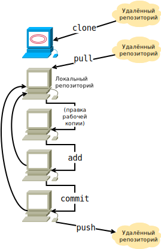

Разработка приложения != сидеть в ИДЕ и вписывать буковки в поле для кода. 
Это полноценный процесс, состоящий из написания кода, документации, дополнительных демонстрационных файлов. Часто вы делаете сборку предполагаемого продукта, который также надо тестировать и отлаживать. Вот весь этот цикл - это разработка as is

Немного поговорим в курсе о том, как сделать нармальную сборку продукта. Метод "написать исходники и дальше пусть люди сами собирают" тоже имеет место быть, но это для любителей

Отдельно до сборки пакетов мы явно не дойдём, но точно попробуем успеть

---------------

Как нас учат в началке, курс разработки состоит из трёх этапов: Редактирование - Сборка/Запуск - Тестирование

Начнём с Редактирования:
Конечно, существуют огромные машины для редактирования - IDE. Там уже за нас все бонусы для работы придумали, подгрузили тонны рецептов сборки, там удобно писать многофайловые проекты. НО.

Мы хотим ИЗУЧИТЬ процесс разработки, а не просто пользоваться уже написанными благами, так что будем писать в просто редакторе, дебажить внешним дебаггером gdb, будем внешне деплоить ручками в репу.

----

В отрыве от больших ИДЭЕх подумаем, что из себя составляет всё сборочное окружение, с которым мы будем сталкиваться:

 - Текстовый редактор, в котором нам удобно будет разрабатывать
 - Компилятор и компоновщик
 - Дополнительные библиотеки, с которыми мы компилируем программу
 - Сборочные библиотеки (потому что для сборки недостаточно иметь саму библиотеку, нужно и её сборочную версию иметь, чтобы потом с ней компоновать прогу)
 - Система Контроля Версий (у нас git)
 - Разные другие непрограммные компоненты (типа переводов)
 - Надо будет поддерживать автоматическую сборку сложного проекта (make и autotools)
 - Информационные инструменты для исследования внешних вещей (просто в лекциях узнаём и ставим)
 - Отладчик

Получается довольно мощный набор инструментов, обычно отсутствующий в "Коробке" linux-системы

Разделим весь этот список на три эшелона:

1. Инструментальные зависимости - ПО, в котором нам удобно разрабатывать (Всё, что нужно для разработки, но не для сборки)
2. Сборочные зависимости - То, чем перегоняем наши программы в исполняемые файлы
3. Эксплуатационные зависимости - То, что нужно, чтобы наши программы непосредственно заработали. Это вообще никак не связано с программированием и сборкой, это довольно узкий класс программ

Из такого разделения понятно, что все эти три куска вообще могут быть на разных устройствах

Однако мы будем использовать old-school-ный вариант, где у нас будет одно общее сборочное окружение

---
Поговорим немножко про `git`
[Книжка про него](https://git-scm.com/book/ru/v2)

Git относится к классу Систем Контроля Версий и обеспечивает три основных класса действий с данными:
 - Их непосредственное хранение
 - Версионирование
 - (Самое важное) Совместную разработку на основе этих данных

На общие свойства СКВ накладывается ещё и Распределённость (Дистрибутивность, но не математическая). Вообще говоря, не существует единого места хранения данных, дабы, как минимум, не ломать изменения друг друга.

*(Добавить описание работы git, его основных понятий и действий с ним)*
TODO: обсудить, какого вида хочется описание - чайниковое или для постарше

