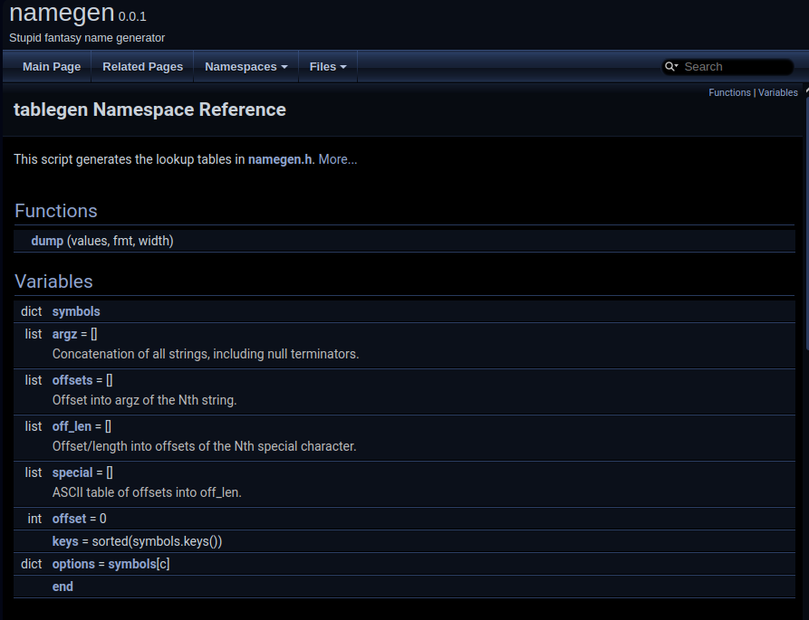
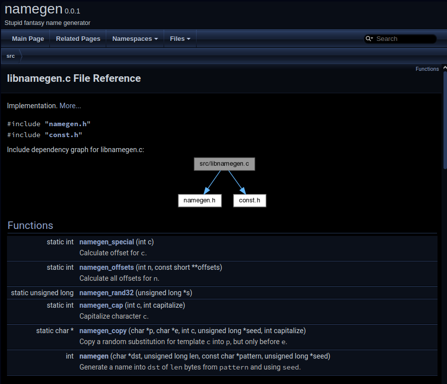
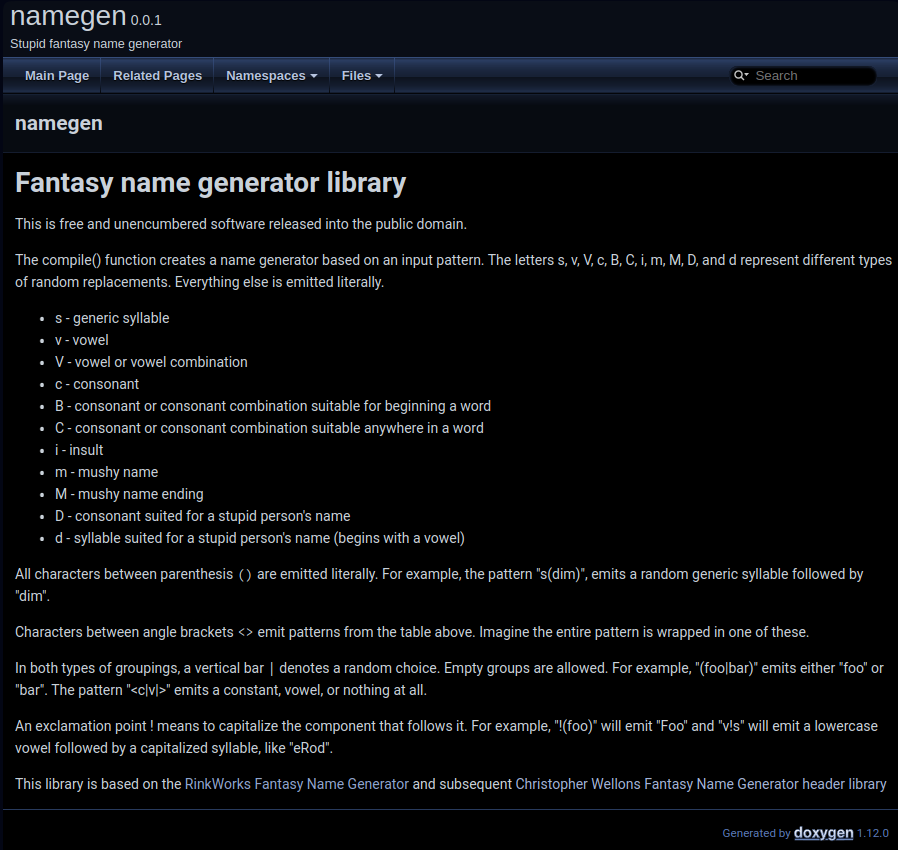

Данный раздел посвящён созданию информационного пространства наших проектов и, в частности, документированию.

Информационное пространство позволяет взаимодействующим с проектом людям ориентироваться в нём, разбираться с доступным функционалом проекта. 

Для разработчиков основное инфопространство занимают описания внутренних элементов проекта - используемые функции, методы, типы и значения переменных. Для сообщества и пользователей основной является информация о возможностях самого продукта и о правилах взаимодействия с ним. При поддержке продукта основную часть инфопространства заполняет описание и струтуризация всех проводящихся изменений проекта. 

В общем, информационное пространство - это огромный пласт разработки, охватывающий каждую её часть. Мы же в рамках этого раздела сделаем упор на техническое документирование проекта

Источники информации
---

Обсудим, как вообще в нашем проекте собирается информация по его внутреннему и внешнему функционалам.

Основной источник информации - документирование самих исходников. Его можно разбить на два основных типа документирования: 
 + ***Комментарии*** - Для оформления понятного информационного документа существует множество методик. Одна из самых популярных - [Literate Programming](https://ru.wikipedia.org/wiki/Грамотное_программирование) - была в 1981 предложена Дональном Кнутом. По его методике для проекта пишется большой информационный текст с описанием всех примеров, и туда добавляются вставки описываемого языка программирования;
 + ***Документирование API*** - Очень важная часть документирования. В первую очередь продукт разраатывается для пользователей, иесли не сопроводить его информацией, как этим продуктом пользоваться, проект загнётся вне зависимости от всех его уникальностей и преимуществ. Документация это первое, что должно меняться при изменениях.  
   Документирование API может поддерживаться внутренними особенностями языка (например, в _Python_ поддерживается автодокументирование функций за счёт обработки "повисших" строк) или с помощью систем синтаксического разбора кода, причём как универсальных ([Sphinx](https://www.sphinx-doc.org/), [Doxygen](https://www.doxygen.nl/)), так и ориентированных на конкретный язык программирования

Не менее важным является обеспечение общего взаимодействия и унифицированное ведение документации в сообществе. Большую работу в этой сфере провёл [Роберт Мартин](https://ru.wikipedia.org/wiki/Мартин%2C_Роберт_%28инженер%29), выпустивший множество работ подисциплине разработки, стилю оформления проектов, структуре каталогов, наименованию и назначению файлов (классический пример оформления - [GNU Hello](https://git.savannah.gnu.org/cgit/hello.git/tree/))

Непосредственное оформление справочников с документацией также имеет свои особенности. Говоря об `offline`-справочниках, нельзя не упомянуть классические `help` и `man`, в которых подробно и без лишней информации описываются все основные параметры и результаты работы описываемых утилит. Ещё одним форматом справочника выступают разного рода генераты и гипертексты, полученные из документированных исходников. Систем документирования бесчисленное количество, каждыйиз них поддерживает разные форматы выходной документации, включая `LaTeX`, `HTML` и так далее. В `online`-документировании полученные справочники могут выкладываться самостоятельно с помощью выгнанной `HTML`-документации, с помощью специализированных движков (`wiki`, [`Pelican`](https://blog.getpelican.com/) и т.д.), сервисов совместной разработки (`README.md` на `Gitlab`/`Github`, `Github Pages` на `Github.io`...) или с помощью специализированных сервисов ([`ReadTheDocs`](https://readthedocs.com/), [`Git Book`](https://www.gitbook.com/) ...)

Doxygen
---

В данном курсе будем разбираться именно с этим документатором. [`Doxygen`](https://www.doxygen.nl/index.html) -  многоязыковая система с кучей приятных бонусов и возможностей. Работает от по принципу синтаксического анализатора -  комментарии специального вида прямо в коде  считываются и обрабатываются системой. При этом `Doxygen` поддерживает форматные комментарии и другие дополнительные 


Процесс создания документации вкладывается в уже ставший нам привычным процесс автосборки проекта через `configure`. Для начала из исходных файлов мы собираем шаблонные файлы для параметров документации, затем заполняем их, указываем формат итоговой документации, собираем проект


Разберём [пример](https://git.sr.ht/~frbrgeorge/namegen) из предыдущего раздела, навесив на него документацию


Для начала создадим шаблонный базовый файловый описатель `Doxyfile.in`

```console
admin@localhost:~/LinuxAppDev/11_Documenting/Lection/namegen> doxygen -g Doxyfile.in 


Configuration file 'Doxyfile.in' created.

Now edit the configuration file and enter

  doxygen Doxyfile.in

to generate the documentation for your project

admin@localhost:~/LinuxAppDev/11_Documenting/Lection/namegen> 
```

```console
admin@localhost:~/LinuxAppDev/11_Documenting/Lection/namegen> cat Doxyfile.in | wc
   2884   21302  129104
admin@localhost:~/LinuxAppDev/11_Documenting/Lection/namegen> 
```
Это наш базовый настройщик документации. Эти почти 3000 строк - в большинстве своём комментарии, описывающие параметры, которые мы можем менять. Вот некоторые поля из этого файла:

`Doxygen.in`
```sh
# The OUTPUT_DIRECTORY tag is used to specify the (relative or absolute) path
# into which the generated documentation will be written. If a relative path is
# entered, it will be relative to the location where Doxygen was started. If
# left blank the current directory will be used.

OUTPUT_DIRECTORY       =

# If the CREATE_SUBDIRS tag is set to YES then Doxygen will create up to 4096
# sub-directories (in 2 levels) under the output directory of each output format
# and will distribute the generated files over these directories. Enabling this
# option can be useful when feeding Doxygen a huge amount of source files, where
# putting all generated files in the same directory would otherwise causes
# performance problems for the file system. Adapt CREATE_SUBDIRS_LEVEL to
# control the number of sub-directories.
# The default value is: NO.

CREATE_SUBDIRS         = NO

# Controls the number of sub-directories that will be created when
# CREATE_SUBDIRS tag is set to YES. Level 0 represents 16 directories, and every
# level increment doubles the number of directories, resulting in 4096
# directories at level 8 which is the default and also the maximum value. The
# sub-directories are organized in 2 levels, the first level always has a fixed
# number of 16 directories.
# Minimum value: 0, maximum value: 8, default value: 8.
# This tag requires that the tag CREATE_SUBDIRS is set to YES.

CREATE_SUBDIRS_LEVEL   = 8

# If the ALLOW_UNICODE_NAMES tag is set to YES, Doxygen will allow non-ASCII
# characters to appear in the names of generated files. If set to NO, non-ASCII
# characters will be escaped, for example _xE3_x81_x84 will be used for Unicode
# U+3044.
# The default value is: NO.

ALLOW_UNICODE_NAMES    = NO

# The OUTPUT_LANGUAGE tag is used to specify the language in which all
# documentation generated by Doxygen is written. Doxygen will use this
# information to generate all constant output in the proper language.
# Possible values are: Afrikaans, Arabic, Armenian, Brazilian, Bulgarian,
# Catalan, Chinese, Chinese-Traditional, Croatian, Czech, Danish, Dutch, English
# (United States), Esperanto, Farsi (Persian), Finnish, French, German, Greek,
# Hindi, Hungarian, Indonesian, Italian, Japanese, Japanese-en (Japanese with
# English messages), Korean, Korean-en (Korean with English messages), Latvian,
# Lithuanian, Macedonian, Norwegian, Persian (Farsi), Polish, Portuguese,
# Romanian, Russian, Serbian, Serbian-Cyrillic, Slovak, Slovene, Spanish,
# Swedish, Turkish, Ukrainian and Vietnamese.
# The default value is: English.

OUTPUT_LANGUAGE        = English

# If the BRIEF_MEMBER_DESC tag is set to YES, Doxygen will include brief member
# descriptions after the members that are listed in the file and class
# documentation (similar to Javadoc). Set to NO to disable this.
# The default value is: YES.

BRIEF_MEMBER_DESC      = YES

# If the REPEAT_BRIEF tag is set to YES, Doxygen will prepend the brief
# description of a member or function before the detailed description
#
# Note: If both HIDE_UNDOC_MEMBERS and BRIEF_MEMBER_DESC are set to NO, the
# brief descriptions will be completely suppressed.
# The default value is: YES.

REPEAT_BRIEF           = YES
```


Теперь заполним наш шаблон, а также внесём его в `configure.ac`

`configure.ac`
```sh
#                                               -*- Autoconf -*-
# Process this file with autoconf to produce a configure script.

AC_PREREQ([2.69])
AC_INIT([Stupid fantasy name generator], [0.0.1], [george@altlinux.org], [namegen])
AM_INIT_AUTOMAKE([foreign])
DX_INIT_DOXYGEN([namegen]) # внесли описание Doxygen
LT_INIT([disable-static])
AC_CONFIG_SRCDIR([src/namegen.c])
AC_CONFIG_HEADERS([config.h])

# Checks for programs.
AC_PROG_CC

# Joint pkgconfig library/include tests
PKG_CHECK_MODULES([CHECK],[check])

# Variable definitins
AC_SUBST(CK_VERBOSITY, verbose)
AC_ARG_VAR(CK_VERBOSITY, [Default: "verbose", can be "silent", "minimal" or "normal")])
# Enabe/disable things
AC_ARG_ENABLE([gcov],
              [AS_HELP_STRING([--enable-gcov], [use Gcov to test the test suite])],
              [], [enable_gcov=no])
AM_CONDITIONAL([COND_GCOV],[test '!' "$enable_gcov" = no])

# Checks for libraries.

# Checks for header files.
AC_CHECK_HEADERS([stddef.h stdlib.h string.h])

# Checks for typedefs, structures, and compiler characteristics.
AC_CHECK_TYPES([ptrdiff_t])

# Checks for library functions.
AC_FUNC_MALLOC
AC_CHECK_FUNCS([memset strchr])

AC_CONFIG_FILES([Makefile
                 tests/Makefile
                 src/Makefile
                 Doxyfile # добавили генерат 
                 ])
AC_OUTPUT
```

Добавляем новые рецепты для `Doxygen` в `Makefile`
`Makefile.am`
```make
SUBDIRS = src tests

@DX_RULES@ # этот макрос притянет нам все правила документирования

all-local:	doxygen-doc

demo:	all
	./src/namegen '!BVCs !DdM'

checklog:	check
	cat tests/*.log

gcov:	check
	$(MAKE) $(MAKEFLAGS) -C src gcov

http:	doxygen-doc # А этот рецепт с помощью python запустит нам сервер с документацией
	python3 -m http.server --directory $</html
```

 В самом `Doxyfile.in` добавили описания параметров
```patch
diff --git a/Doxyfile.in b/Doxyfile.in
index d1f903c..f951d56 100644
--- a/Doxyfile.in
+++ b/Doxyfile.in
@@ -42,19 +42,19 @@ DOXYFILE_ENCODING      = UTF-8
 # title of most generated pages and in a few other places.
 # The default value is: My Project.
 
-PROJECT_NAME           = "@PACKAGE_TARNAME@"
+PROJECT_NAME           = "My Project"
 
 # The PROJECT_NUMBER tag can be used to enter a project or revision number. This
 # could be handy for archiving the generated documentation or if some version
 # control system is used.
 
-PROJECT_NUMBER         = @PACKAGE_VERSION@
+PROJECT_NUMBER         =
 
<...>
```


Теперь добавим сами комментарии, которые должны будут уйти в документацию. У нас есть поддержка и однострочных, и многострочных комментариев, кроме того, для каждого языка программирования свой формат комментариев. 

`libnamegen.c`
```c
/* Fantasy name generator ANSI C header library
 * This is free and unencumbered software released into the public domain.
 *
 * The compile() function creates a name generator based on an input
 * pattern. The letters s, v, V, c, B, C, i, m, M, D, and d represent
 * different types of random replacements. Everything else is emitted
 * literally.
 *
 * - s - generic syllable
 * - v - vowel
 * - V - vowel or vowel combination
 * - c - consonant
 * - B - consonant or consonant combination suitable for beginning a word
 * - C - consonant or consonant combination suitable anywhere in a word
 * - i - insult
 * - m - mushy name
 * - M - mushy name ending
 * - D - consonant suited for a stupid person's name
 * - d - syllable suited for a stupid person's name (begins with a vowel)
 *
 * All characters between parenthesis `()` are emitted literally. For
 * example, the pattern "s(dim)", emits a random generic syllable
 * followed by "dim".
 *
 * Characters between angle brackets `<>` emit patterns from the table
 * above. Imagine the entire pattern is wrapped in one of these.
 *
 * In both types of groupings, a vertical bar `|` denotes a random choice.
 * Empty groups are allowed. For example, "(foo|bar)" emits either "foo"
 * or "bar". The pattern "<c|v|>" emits a constant, vowel, or nothing at
 * all.
 *
 * An exclamation point ! means to capitalize the component that follows
 * it. For example, "!(foo)" will emit "Foo" and "v!s" will emit a
 * lowercase vowel followed by a capitalized syllable, like "eRod".
 *
 * This library is based on the [RinkWorks Fantasy Name Generator](http://www.rinkworks.com/namegen/) and subsequent [Christopher Wellons Fantasy Name Generator header library](https://github.com/skeeto/fantasyname/tree/master/c)
 */
#include "namegen.h"
#include "const.h"

/** @file libnamegen.c
 * Implementation
 *
 * Rather than compile the pattern into some internal representation,
 * the name is generated directly from the pattern in a single pass
 * using reservoir sampling. If an alternate option is selected, the
 * output pointer is reset to "undo" the output for the previous group.
 * This means the output buffer may be written beyond the final output
 * length (but never beyond the buffer length).
 *
 * The substitution templates are stored in an efficient, packed form
 * that contains no pointers. This is to avoid cluttering up the
 * relocation table, but without any additional run-time overhead.
 */

/** Calculate offset for @p c.
 *
 * @param c special character in from table
 * @return offsets table offset for @p c, or -1 if not special
 *
 * The return value is suitable for namegen_offsets().
 */
static int
namegen_special(int c)
{
    if (c >= 0 && c < 128)
        return special[c];
    return -1;
}

/** Calculate all offsets for @p n
 *
 * @param n special
 * @param offsets all offsets for @n buffer
 * @return offsets and number of offsets for special @p n.
 * @p offsets point into namegen_argz.
 */
static int
namegen_offsets(int n, const short **offsets)
{
    *offsets = offsets_table + off_len[n * 2 + 0];
    return off_len[n * 2 + 1];
}

static unsigned long
namegen_rand32(unsigned long *s)
{
    unsigned long x = *s;
    x ^= x << 13;
    x ^= (x & 0xffffffffUL) >> 17;
    x ^= x << 5;
    return (*s = x) & 0xffffffffUL;
}

/** Capitalize character @p c.
 *
 * @param c character
 * @param capitalize whther capitalization is needed
 */
static int
namegen_cap(int c, int capitalize)
{
    return capitalize && c >= 'a' && c <= 'z' ? c & ~0x20 : c;
}

/** Copy a random substitution for template @p c into @p p, but only before @p e.
 *
 * @param p destinatiornb buffer
 * @param e stop pointer in template
 * @param c source template buffer
 * @param seed random seed
 * @param capitalize where to capitalize substitution
 * @return destination buffer @p
 */
static char *
namegen_copy(char *p, char *e, int c, unsigned long *seed, int capitalize)
{
    int n = namegen_special(c);
    if (n == -1) {
        if (p != e)
            *p++ = namegen_cap(c, capitalize);
    } else {
        const short *offsets;
        int count = namegen_offsets(n, &offsets);
        int select = namegen_rand32(seed) % count;
        const char *s = namegen_argz + offsets[select];
        while (*s) {
            int r = *s++;
            if (p != e)
                *p++ = namegen_cap(r, capitalize);
            capitalize = 0;
        }
    }
    return p;
}

/** Generate a name into @p dst of @p len bytes from @p pattern and using @p seed.
 *
 * The length must be non-zero. For best results, the lower 32 bits of
 * the seed should be thoroughly initialized. A particular seed will
 * produce the same results on all platforms.
 *
 * @param dst buffer to put generated name to
 * @param len buffer length (in bytes)
 * @param pattern name pattern
 * @param seed random seed
 *
 * The return value is one of the above codes, indicating success or
 * that something went wrong. Truncation occurs when @p dst was too short.
 * Pattern is validated even when the output has been truncated.
 *
 * @return error code
 */
int
namegen(char *dst, unsigned long len, const char *pattern, unsigned long *seed)
{
    int depth = 0;               /* Current nesting depth */
    char *p = dst;               /* Current output pointer */
    char *e = dst + len;         /* Maxiumum output pointer */
    int capitalize = 0;          /* Capitalize next item */

    /* Stacks */
    char *reset[NAMEGEN_MAX_DEPTH];     /* Reset pointer (undo generate) */
    unsigned long n[NAMEGEN_MAX_DEPTH]; /* Number of groups */
    unsigned long silent = 0;    /* Actively generating? */
    unsigned long literal = 0;   /* Current "mode" */
    unsigned long capstack = 0;  /* Initial capitalization state */

    n[0] = 1;
    reset[0] = dst;
    for (; *pattern; pattern++) {
        unsigned long bit; /* Bit for current depth */
        int c = *pattern;
        switch (c) {
            case '<':
                if (++depth == NAMEGEN_MAX_DEPTH) {
                    *dst = 0;
                    return NAMEGEN_TOO_DEEP;
                }
                bit = 1UL << depth;
                n[depth] = 1;
                reset[depth] = p;
                literal &= ~bit;
                silent &= ~bit;
                silent |= (silent << 1) & bit;
                capstack &= ~bit;
                capstack |= (unsigned long)capitalize << depth;
                break;

            case '(':
                if (++depth == NAMEGEN_MAX_DEPTH) {
                    *dst = 0;
                    return NAMEGEN_TOO_DEEP;
                }
                bit = 1UL << depth;
                n[depth] = 1;
                reset[depth] = p;
                literal |= bit;
                silent &= ~bit;
                silent |= (silent << 1) & bit;
                capstack &= ~bit;
                capstack |= (unsigned long)capitalize << depth;
                break;

            case '>':
                if (depth == 0) {
                    *dst = 0;
                    return NAMEGEN_INVALID;
                }
                bit = 1UL << depth--;
                if (literal & bit) {
                    *dst = 0;
                    return NAMEGEN_INVALID;
                }
                break;

            case ')':
                if (depth == 0) {
                    *dst = 0;
                    return NAMEGEN_INVALID;
                }
                bit = 1UL << depth--;
                if (!(literal & bit)) {
                    *dst = 0;
                    return NAMEGEN_INVALID;
                }
                break;

            case '|':
                bit = 1UL << depth;
                /* Stay silent if parent group is silent */
                if (!(silent & (bit >> 1))) {
                    if (namegen_rand32(seed) < 0xffffffffUL / ++n[depth]) {
                        /* Switch to this option */
                        p = reset[depth];
                        silent &= ~bit;
                        capitalize = !!(capstack & bit);
                    } else {
                        /* Skip this option */
                        silent |= bit;
                    }
                }
                break;

            case '!':
                capitalize = 1;
                break;

            default:
                bit = 1UL << depth;
                if (!(silent & bit)) {
                    if (literal & bit) {
                        /* Copy value literally */
                        if (p != e)
                            *p++ = namegen_cap(c, capitalize);
                    } else {
                        /* Copy a substitution */
                        p = namegen_copy(p, e, c, seed, capitalize);
                    }
                }
                capitalize = 0;
        }
    }

    if (depth) {
        *dst = 0;
        return NAMEGEN_INVALID;
    } else if (p == e) {
        p[-1] = 0;
        return NAMEGEN_TRUNCATED;
    } else {
        *p = 0;
        return NAMEGEN_SUCCESS;
    }
}
```

`namegen.h`
```c
#ifndef NAMEGEN_H
#define NAMEGEN_H

#define NAMEGEN_MAX_DEPTH  32 /**< Cannot exceed bits in a long */

/* Return codes */
#define NAMEGEN_SUCCESS    0
#define NAMEGEN_TRUNCATED  1  /**< Output was truncated */
#define NAMEGEN_INVALID    2  /**< Pattern is invalid */
#define NAMEGEN_TOO_DEEP   3  /**< Pattern exceeds maximum nesting depth */

int namegen(char *, unsigned long, const char *, unsigned long *);

#endif
```

`tablegen.py`
```python
#!/usr/bin/env python3

## @package tablegen
# This script generates the lookup tables in namegen.h. To change those
# tables, modify the symbols dictionary in this script, execute it to
# generate the new tables, then replace the tables in the C source.

symbols = {
    's': [
        'ach', 'ack', 'ad', 'age', 'ald', 'ale', 'an', 'ang', 'ar', 'ard',
        'as', 'ash', 'at', 'ath', 'augh', 'aw', 'ban', 'bel', 'bur', 'cer',
        'cha', 'che', 'dan', 'dar', 'del', 'den', 'dra', 'dyn', 'ech', 'eld',
        'elm', 'em', 'en', 'end', 'eng', 'enth', 'er', 'ess', 'est', 'et',
        'gar', 'gha', 'hat', 'hin', 'hon', 'ia', 'ight', 'ild', 'im', 'ina',
        'ine', 'ing', 'ir', 'is', 'iss', 'it', 'kal', 'kel', 'kim', 'kin',
        'ler', 'lor', 'lye', 'mor', 'mos', 'nal', 'ny', 'nys', 'old', 'om',
        'on', 'or', 'orm', 'os', 'ough', 'per', 'pol', 'qua', 'que', 'rad',
        'rak', 'ran', 'ray', 'ril', 'ris', 'rod', 'roth', 'ryn', 'sam', 'say',
        'ser', 'shy', 'skel', 'sul', 'tai', 'tan', 'tas', 'ther', 'tia', 'tin',
        'ton', 'tor', 'tur', 'um', 'und', 'unt', 'urn', 'usk', 'ust', 'ver',
        'ves', 'vor', 'war', 'wor', 'yer'
    ],
    'v': ['a', 'e', 'i', 'o', 'u', 'y'],
    'V': [
        'a', 'e', 'i', 'o', 'u', 'y', 'ae', 'ai', 'au', 'ay', 'ea', 'ee', 'ei',
        'eu', 'ey', 'ia', 'ie', 'oe', 'oi', 'oo', 'ou', 'ui'
    ],
    'c': [
        'b', 'c', 'd', 'f', 'g', 'h', 'j', 'k', 'l', 'm', 'n', 'p', 'q', 'r',
        's', 't', 'v', 'w', 'x', 'y', 'z'
    ],
    'B': [
        'b', 'bl', 'br', 'c', 'ch', 'chr', 'cl', 'cr', 'd', 'dr', 'f', 'g',
        'h', 'j', 'k', 'l', 'll', 'm', 'n', 'p', 'ph', 'qu', 'r', 'rh', 's',
        'sch', 'sh', 'sl', 'sm', 'sn', 'st', 'str', 'sw', 't', 'th', 'thr',
        'tr', 'v', 'w', 'wh', 'y', 'z', 'zh'
    ],
    'C': [
        'b', 'c', 'ch', 'ck', 'd', 'f', 'g', 'gh', 'h', 'k', 'l', 'ld', 'll',
        'lt', 'm', 'n', 'nd', 'nn', 'nt', 'p', 'ph', 'q', 'r', 'rd', 'rr',
        'rt', 's', 'sh', 'ss', 'st', 't', 'th', 'v', 'w', 'y', 'z'
    ],
    'i': [
        'air', 'ankle', 'ball', 'beef', 'bone', 'bum', 'bumble', 'bump',
        'cheese', 'clod', 'clot', 'clown', 'corn', 'dip', 'dolt', 'doof',
        'dork', 'dumb', 'face', 'finger', 'foot', 'fumble', 'goof', 'grumble',
        'head', 'knock', 'knocker', 'knuckle', 'loaf', 'lump', 'lunk', 'meat',
        'muck', 'munch', 'nit', 'numb', 'pin', 'puff', 'skull', 'snark',
        'sneeze', 'thimble', 'twerp', 'twit', 'wad', 'wimp', 'wipe'
    ],
    'm': [
        'baby', 'booble', 'bunker', 'cuddle', 'cuddly', 'cutie', 'doodle',
        'foofie', 'gooble', 'honey', 'kissie', 'lover', 'lovey', 'moofie',
        'mooglie', 'moopie', 'moopsie', 'nookum', 'poochie', 'poof', 'poofie',
        'pookie', 'schmoopie', 'schnoogle', 'schnookie', 'schnookum', 'smooch',
        'smoochie', 'smoosh', 'snoogle', 'snoogy', 'snookie', 'snookum',
        'snuggy', 'sweetie', 'woogle', 'woogy', 'wookie', 'wookum', 'wuddle',
        'wuddly', 'wuggy', 'wunny'
    ],
    'M': [
        'boo', 'bunch', 'bunny', 'cake', 'cakes', 'cute', 'darling',
        'dumpling', 'dumplings', 'face', 'foof', 'goo', 'head', 'kin', 'kins',
        'lips', 'love', 'mush', 'pie', 'poo', 'pooh', 'pook', 'pums'
    ],
    'D': [
        'b', 'bl', 'br', 'cl', 'd', 'f', 'fl', 'fr', 'g', 'gh', 'gl', 'gr',
        'h', 'j', 'k', 'kl', 'm', 'n', 'p', 'th', 'w'
    ],
    'd': [
        'elch', 'idiot', 'ob', 'og', 'ok', 'olph', 'olt', 'omph', 'ong', 'onk',
        'oo', 'oob', 'oof', 'oog', 'ook', 'ooz', 'org', 'ork', 'orm', 'oron',
        'ub', 'uck', 'ug', 'ulf', 'ult', 'um', 'umb', 'ump', 'umph', 'un',
        'unb', 'ung', 'unk', 'unph', 'unt', 'uzz'
    ]
}

# Форматные комментарии

## Concatenation of all strings, including null terminators
argz = []
## Offset into argz of the Nth string
offsets = []
## Offset/length into offsets of the Nth special character
off_len = []
## ASCII table of offsets into off_len
special = []

offset = 0
keys = sorted(symbols.keys())
for c in keys:
    options = symbols[c]
    off_len.append(len(argz))
    off_len.append(len(options))
    for option in options:
        offsets.append(offset)
        offset = offset + len(option) + 1
        argz.append(option)

for c in range(0, 128):
    try:
        special.append(keys.index(chr(c)))
    except ValueError:
        special.append(-1)

# Prints a C array initializer
def dump(values, fmt, width):
    for i, v in enumerate(values):
        if i > 0:
            print(',', end='')
        if i % width == 0:
            print('\n    ', end='')
        else:
            print(' ', end='')
        print(fmt(v), end='');
    print('\n};\n')

print('static const signed char special[] = {', end='')
dump(special, lambda v: '  -1' if v < 0 else '0x%02x' % v, 8)

print('static const short offsets_table[] = {', end='')
dump(offsets, lambda v: '0x%04x' % v, 8)

print('static const short off_len[] = {', end='')
dump(off_len, lambda v: '0x%04x' % v, 8)

print('static const char namegen_argz[] = {', end='')
dump('\0'.join(argz) + '\0', lambda v: ' 0 ' if v == '\0' else "'%c'" % v, 15)
```





 Документация поддерживает гиперссылки, а также (при предустановленной утилите  [Graphviz](https://graphviz.org)) графики зависимостей наших файлов.

Отлично! Наша документация работает, однако сейчас не показывает главную страницу с документацией. Добавим для некоторых комментариев метку `@mainpage` для некоторых страниц, чтобы заполнить главный экран
Также мы хотим, чтобы нами генерируемая документация сохранялась при установке проекта извне. Поэтому соответсвующий рецепт указываем в `Makefile.am`

`Makefile.am`
```make
SUBDIRS = src tests

@DX_RULES@

all-local:	doxygen-doc

install-data-local: # вот он
	mkdir -p $(DESTDIR)/$(docdir)
	cp -a doxygen-doc/html $(DESTDIR)/$(docdir)

demo:	all
	./src/namegen '!BVCs !DdM'

checklog:	check
	cat tests/*.log

gcov:	check
	$(MAKE) $(MAKEFLAGS) -C src gcov

http:	doxygen-doc
	python3 -m http.server --directory $</html 5000
```




Теперь добавим генерацию других документов, например, [`man`](https://man7.org/linux/man-pages/man1/man.1.html)

Для создания Мана можно пользоваться макропакетами и спецформатами (например, [`troff`](https://liw.fi/manpages/)) или просто конвертировать текстовые исходники (с помощью `txt2man`,  [`scdoc`](https://git.sr.ht/~sircmpwn/scdoc) и другие конверторы)

Мы же напишем `man` на нашем же `Doxygen`, он умеет создавать и такие генераты.


Для начала включаем параметр в `Doxyfile.in`
```patch
@@ -2226,7 +2226,7 @@ RTF_EXTRA_FILES        =
 # classes and files.
 # The default value is: NO.
 
-GENERATE_MAN           = NO
+GENERATE_MAN           = YES
 
 # The MAN_OUTPUT tag is used to specify where the man pages will be put. If a
 # relative path is entered the value of OUTPUT_DIRECTORY will be put in front of
@@ -2244,7 +2244,7 @@ MAN_OUTPUT             = man
 # The default value is: .3.
 # This tag requires that the tag GENERATE_MAN is set to YES.
 
-MAN_EXTENSION          = .3
+MAN_EXTENSION          = .1
```

Внесём man-информацию в файл с кодом

`namegen.c`
```c
#include "config.h"
#include "namegen.h"
#include <time.h>
#include <stdio.h>
#include <stddef.h>
#include <stdlib.h>
#include <string.h>

static unsigned long
hash32(unsigned long a)
{
    a = a & 0xffffffffUL;
    a = (a ^ 61UL) ^ (a >> 16);
    a = (a + (a << 3)) & 0xffffffffUL;
    a = a ^ (a >> 4);
    a = (a * 0x27d4eb2dUL) & 0xffffffffUL;
    a = a ^ (a >> 15);
    return a;
}

/*Добавили man*/

/** @page namegen
 * Fantasy name generator
 * @section SYNOPSIS
 * `namegen` \a pattern [ \a number ]
 * @section DESCRIPTION
 * Generate a fantasy name (or a \a number of names, if \a number is provided) according to \a pattern.
 *
 * @copydetails library
 */
int
main(int argc, char **argv)
{
    int i;
    int count = 1;
    FILE *urandom;
    unsigned char randbuf[4];
    unsigned long seed[] = {0x8af611acUL};

    /* Parse command line arguments */
    if (argc < 2 || argc > 3 || !strcmp(argv[1], "-h") || !strcmp(argv[1], "--help")) {
        printf("Usage: %s <pattern> [num]\n", argv[0]);
        printf("  pattern   template for names to generate\n");
        printf("  num       number of names to generate\n");
        exit(EXIT_FAILURE);
    } else if (argc == 3) {
        count = atoi(argv[2]);
    }

    /* Shuffle up the seed a bit */
    urandom = fopen("/dev/urandom", "rb");
    if (urandom && fread(randbuf, sizeof(randbuf), 1, urandom)) {
        unsigned long rnd =
            (unsigned long)randbuf[0] <<  0 |
            (unsigned long)randbuf[1] <<  8 |
            (unsigned long)randbuf[2] << 16 |
            (unsigned long)randbuf[3] << 24;
        *seed ^= rnd;
        fclose(urandom);
    } else {
        void *p = malloc(4UL * 1024 * 1024);
        *seed ^= hash32(time(0));             /* Current time */
        *seed ^= hash32((ptrdiff_t)main);     /* ASLR entopy */
        *seed ^= hash32((ptrdiff_t)seed);     /* Stack gap entropy */
        *seed ^= hash32((ptrdiff_t)p);        /* Allocator entropy */
        *seed ^= hash32((ptrdiff_t)malloc);   /* C library ASLR */
        free(p);
    }

    /* Generate some names */
    for (i = 0; i < count; i++) {
        char buf[256];
        int r = namegen(buf, sizeof(buf), argv[1], seed);
        if (r == NAMEGEN_INVALID) {
            fprintf(stderr, "%s: invalid pattern\n", argv[0]);
            exit(EXIT_FAILURE);
        }
        printf("%s\n", buf);
    }
    return 0;
}

```

Добавим в `Makefile` рецепт по генерации `man`

`Makefile.am`
```make
SUBDIRS = src tests

@DX_RULES@

all-local:	doxygen-doc

doxygen-doc/man/man1/namegen.1:	doxygen-doc

man1_MANS = doxygen-doc/man/man1/namegen.1

install-data-local:
	mkdir -p $(DESTDIR)/$(docdir)
	cp -a doxygen-doc/html $(DESTDIR)/$(docdir)

demo:	all
	./src/namegen '!BVCs !DdM'

checklog:	check
	cat tests/*.log

gcov:	check
	$(MAKE) $(MAKEFLAGS) -C src gcov

http:	doxygen-doc
	python3 -m http.server --directory $</html 5000
```


Проверим, что наш `man` (а с ним и какой-никакой `--help`) отлично генерируется и работает

```console
admin@localhost:~/LinuxAppDev/11_Documenting/Lection/namegen> man ./doxygen-doc/man/man1/namegen.c.1 


src/namegen.c(1)            General Commands Manual            src/namegen.c(1)

NAME
       src/namegen.c

SYNOPSIS
       #include 'config.h'
       #include 'namegen.h'
       #include <time.h>
       #include <stdio.h>
       #include <stddef.h>
       #include <stdlib.h>
       #include <string.h>

   Functions
       static unsigned long hash32 (unsigned long a)
       int main (int argc, char **argv)

Function Documentation
   static unsigned long hash32 (unsigned long a) [static]
   int main (int argc, char ** argv)
Author
       Generated automatically by Doxygen for namegen from the source code.

namegen                          Version 0.0.1                 src/namegen.c(1)
```


Домашнее задание
---

Взять за основу [программу для угадывания чисел из старого Д/З](https://uneex.org/LecturesCMC/LinuxApplicationDevelopment2024/08_I18n#A.2BBBQ-.2F.2BBBc-)
 + Дописать к ней две функции — перевод из римской системы счисления и обратно
     + Поскольку диапазон `1…100`, проще всего сделать табличку на 100 элементов  при помощи [roman](https://pypi.python.org/pypi/roman "pypi"))
+ Научить саму программу принимать из командной строки параметр `-r` для работы в римской системе счисления
+ Задокументировать эти функции (и, возможно, другие, буде они у вас есть), а так же макросы и глобальные переменные (которые сочтёте нужными)
+ Обеспечить программе вменяемый `--help` (**на двух языках**!) и `man` (на одном)    
+ Заполнить этим `help`-ом титульную страницу документации

***Некоторые подробности***
+ Титульную страничку придётся генерировать чем-то боле сложным, чем `LC_ALL=C ./number-game --help`. Например, научить саму программу чему-то вроде `--help-md` (в который она подставляет команды `Doxygen`) или обработать `--hеlp` чем-то ещё
+ Если ничего не поможет, забейте и тупо скопируйте. Ну не будет у вас титульная страница генератом, возможно, начнёт расходиться с `--help` и `man`, и что?
+ (необязательно, для тех, кто хочет поупражняться программировать на Си) Увеличить диапазон до `1…3999`