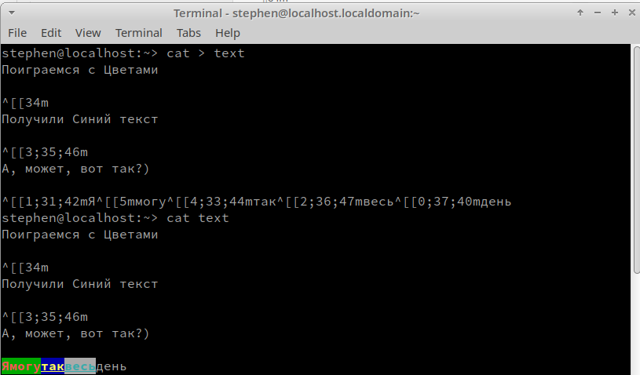
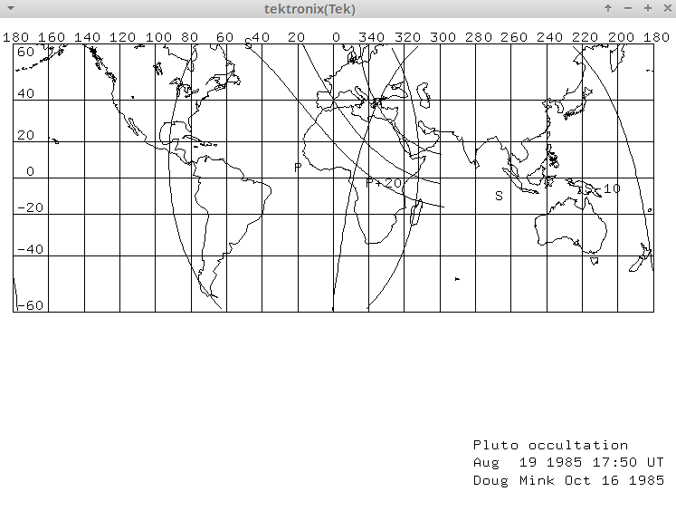
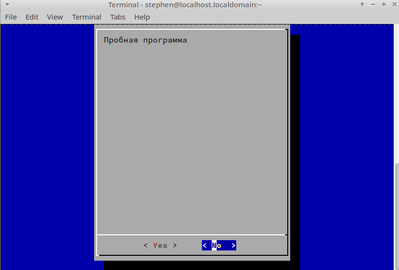
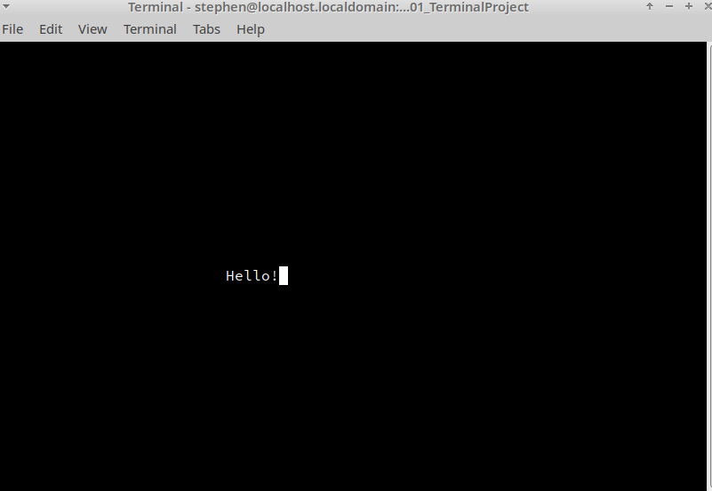
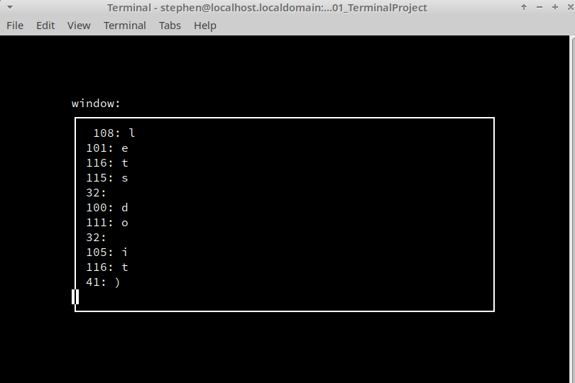

   Данный раздел будет посвящён основному устройству, через которое так или иначе проводится всё взаимодействие с кишочками компьютера руками программиста - терминалу. Так сказать, от человеческих целей что-то сделать компьютером до непосредственной реализации этого чего-то, терминал это самый простой способ.
   
# Немного теории про терминал

Терминал - это устройство, которое обеспечивает ввод-вывод байтов на компьютер. Ровным счётом, всё. Никаких волшебных свойств, накрученных механизмов. Просто что-то, куда можно вводить байты и откуда их можно получать, плюс минимальная подкапотная обработка для перевода с символьного языка на машинные команды.


Работать с компьютером вслепую было очень неудобно. Да, у тебя есть куча перфокарт, которые можно заранее под каждое действие компьютера прописать, но человеческий фактор никто не отменял, и хотелось бы при возникновении какой-то ошибки не перечитывать выколотые точки на бумажке и не искать, где какая информационная лампочка у компьютера загорелась, а вот в одно место куда-то получать ответ. А если с этого места можно будет эти самые команды компьютеру передавать вместо кучи перфокарт, так ещё и делать это прямо во время работы, жить стало бы сильно проще.

Первым терминалом стал [Телетайп](https://ru.wikipedia.org/wiki/Телетайп). Он представлял собой пишущую машинку, подключённую к компьютеру, которая печатает на бумажку текст, после чего этот текст можно было автоматически загнать в компьютер, он обрабатывался, как последовательность байт, отрабатывал команду, после чего на бумажку выводил ответ.

Это нововведение в те годы произвело невероятный скачок в работе с ЭВМ. Ничего роднее пишущей машинки для человека того времени не было. Более того, было понятно, как и эту вещь можно дальше улучшать и модифицировать. С приходом в общее пользование электронно-лучевых трубок бумажная лента заменилась на экран, но идеи, которые вложили тогда для работы через терминал, живут и актуальны до сих пор. Просто потому что лучше придумывать и не надо, всё уже максимально адаптировано.

Телетайпы стали настолько неотъемлемой частью компьютера, что современные технологии кишат отсылками на это явление:
1. Порты в файловой системе Unix-подобных систем до сих пор называются `/dev/tty` как сокращение от `/devices/teletypes`
2. `telnet` — сетевой протокол для реализации текстового терминального интерфейса по сети - также имеет своё название именно благодаря телетайпам (***teletype network***)

Также ещё с тех времён остались классические текстовые построчные редакторы. Да, «на листочке» работу с полным файлом трудно делать.  А построчно смотреть, изменять итд - вполне))

Рассмотрим небольшой примерчик с использованием одного из таких редакторов — [ed](https://ru.wikipedia.org/wiki/Ed):
```console
admin@localhost:~> cat text
First str
Second str
Third str
admin@localhost:~> ed -p 'ed> ' text    # 'ed> ' — подсказка в диалоге редактора
31                                      # Размер файла
ed> 3                                   # Перейдём к третьей строке
Third str
ed> i                                   # Вставим текст перед ней
Hehehe
.                                       # Единственная точка в строке — конец ввода
ed> ,p                                  # Выведем весь текст
First str                               #   полный фомат: <начало>,<конец>p
Second str                              #   по умолчанию — начало и конец файла
Hehehe
Third str
ed> 1                                   # Перейдём к перводй строке
First str
ed> s/First/Hahaha/                     # Заменим First на Hahaha
ed> .                                   # Выведем текущую строку
Hahaha str
ed> ,p                                  # Выведем весь текст
Hahaha str
Second str
Hehehe
Third str
ed> w                                   # Запишем обратно в файл…
39
ed> q                                   # …и выйдем
admin@localhost:~> cat text 
Hahaha str
Second str
Hehehe
Third str
admin@localhost:~> 
```

Управление через терминал
---

Итак, с историей всё понятно. Основная мысль: «Терминал - основа управления компьютером». Но отсюда идёт логичный вопрос: а как управлять? Просто писать команды? А если я хочу просто текст в виде команды написать, а не команду? Нужно как-то отделять, когда мы вводим просто символы, а когда управляющие команды.

Именно с такими размышлениями разработчики той самой логики работы терминала выделили некоторые байты в качестве управляющих:
* Raw mode — необработанный режим: байты передаются как есть
* Cooked mode — обработанный режим:
    1. Построчная и посимвольная активация. Работа терминала «на бумажке» предполагала сначала ввод команды, а после запуск её в обработку после нажатия клавиши «Enter» (именно поэтому она называется «Ввод», а не «Перевод строки», на как на пишущих машинках!). В случае с электронной обработкой стала доступна возможность сразу обрабатывать вводимые символы и EcsSeq без подтверждения ввода(`raw mode`)
    2. Игры с переводом строки. У ручной пишущей машинки было два действия: перевод строки (рычаг, который прокручивал валик с бумагой на слеедующую строку) и возврат каретки (ручка, которую следовало тянуть, чтобы затем печатать текст с начала строки). Как правило, оба действия совмещались — в произвольном порядке. На телетайпах это соответсвовало выводу двух символов — [перевода строки `\n` и возврата каретки `\r`](https://ru.wikipedia.org/wiki/Перевод_строки). В UNIX-системах, а вслед за ними — и в Linux — это поведение унифицировали: в конце строки стоит _один_ символ (это `\n`) а при вводе-выводе в cooked mode он преобразуется, если это требуется в два в нужном порядке. Дело осложняется тем, что в других операционых системах эту (Windows и ранние версии MacOS) унификацию пытались делать по-другому.
    3. Преобразование символов в сигналы. Некоторый вводимые в терминал символы вообще не доходят до ввода запущенной программы: их перехватывает операционная система. Например, при нажатии `Ctrl+C` _посылается_ символ с ASCII-кодом 3. На терминалах клавиша `Ctrl` просто обнуляла шестой бит передаваемого символа: код `C` — 1000011₂, код `Ctrl+C` — 0000011₂. Этот символ не передаётся в программу, котороая считывает данные с терминала; вместо этого операцонная система посылент этой программе сигнал `SIGINT`.

Полный список управляющих байтов, обрабатываемых при работе в терминале, а также другие его характеристики можно посмотреть с помощью команды `stty`

```console
admin@localhost:~> stty -a
speed 38400 baud; rows 24; columns 80; line = 0;
intr = ^C; quit = ^\; erase = ^?; kill = ^U; eof = ^D; eol = <undef>;
eol2 = <undef>; swtch = <undef>; start = ^Q; stop = ^S; susp = ^Z; rprnt = ^R;
werase = ^W; lnext = ^V; discard = ^O; min = 1; time = 0;
-parenb -parodd -cmspar cs8 -hupcl -cstopb cread -clocal -crtscts
-ignbrk -brkint -ignpar -parmrk -inpck -istrip -inlcr -igncr icrnl ixon -ixoff
-iuclc -ixany -imaxbel iutf8
opost -olcuc -ocrnl onlcr -onocr -onlret -ofill -ofdel nl0 cr0 tab0 bs0 vt0 ff0
isig icanon iexten echo echoe echok -echonl -noflsh -xcase -tostop -echoprt
echoctl echoke -flusho -extproc
```

Ещё одно телетайпное легаси, которое дожило до наших дней — это подчёркивание и двойная печать. Для редактирования текста в пишущей машинке использовались возможности сдвига каретки; так, например, для подчёркивания символа каретку отгоняли назад и печатали подчёркивание поверх (получается, «под низ»?) символа; для создания жирного шрифта делали множественную повторную печать. В подсистеме просмотра руководвств Linux — `man` — текст руководства размечается именно таким способом:
* Сначала файл руководства рапаковывается и форматируется с помощью `nroff`:
```console
admin@localhost:~> xz -d < /usr/share/man/man1/man.1.xz | nroff -mandoc -Tutf8
MAN(1)                        Manual pager utils                        MAN(1)


NAME
       man - an interface to the system reference manuals

SYNOPSIS
       man [man options] [[section] page ...] ...
       man -k [apropos options] regexp ...
…
```
* Никаких следов разметки тут не видно, но если прибавить к выводу шестнадцатеричный дамп, мы увидим конструкции типа `_` + `backspace` + `символ` и `символ`+ `backspace` + `символ`:
```shell
admin@localhost:~> xz -d < /usr/share/man/man1/man.1.xz | nroff -mandoc -Tutf8 | hexdump -C | head -16
00000000  4d 41 4e 28 31 29 20 20  20 20 20 20 20 20 20 20  |MAN(1)          |
00000010  20 20 20 20 20 20 20 20  20 20 20 20 20 20 4d 61  |              Ma|
00000020  6e 75 61 6c 20 70 61 67  65 72 20 75 74 69 6c 73  |nual pager utils|
00000030  20 20 20 20 20 20 20 20  20 20 20 20 20 20 20 20  |                |
00000040  20 20 20 20 20 20 20 20  4d 41 4e 28 31 29 0a 0a  |        MAN(1)..|
00000050  0a 0a 4e 08 4e 41 08 41  4d 08 4d 45 08 45 0a 20  |..N.NA.AM.ME.E. |
00000060  20 20 20 20 20 20 6d 61  6e 20 2d 20 61 6e 20 69  |      man - an i|
00000070  6e 74 65 72 66 61 63 65  20 74 6f 20 74 68 65 20  |nterface to the |
00000080  73 79 73 74 65 6d 20 72  65 66 65 72 65 6e 63 65  |system reference|
00000090  20 6d 61 6e 75 61 6c 73  0a 0a 53 08 53 59 08 59  | manuals..S.SY.Y|
000000a0  4e 08 4e 4f 08 4f 50 08  50 53 08 53 49 08 49 53  |N.NO.OP.PS.SI.IS|
000000b0  08 53 0a 20 20 20 20 20  20 20 6d 08 6d 61 08 61  |.S.       m.ma.a|
000000c0  6e 08 6e 20 5b 5f 08 6d  5f 08 61 5f 08 6e 20 5f  |n.n [_.m_.a_.n _|
000000d0  08 6f 5f 08 70 5f 08 74  5f 08 69 5f 08 6f 5f 08  |.o_.p_.t_.i_.o_.|
000000e0  6e 5f 08 73 5d 20 5b 5b  5f 08 73 5f 08 65 5f 08  |n_.s] [[_.s_.e_.|
000000f0  63 5f 08 74 5f 08 69 5f  08 6f 5f 08 6e 5d 20 5f  |c_.t_.i_.o_.n] _|
```
* А уже затем утилита [less](https://ru.wikipedia.org/wiki/Less) превратит эту разметку в жирный и подчёркнутый шрифт:
```console
admin@localhost:~> xz -d < /usr/share/man/man1/man.1.xz | nroff -mandoc -Tutf8 | less
…
```


Игры с Escape-последовательностями
---
Вопрос: _а как_? Нельзя же вывести «подчёркнутый байт»?

Ответ: часть байтов, выводимых на терминал, воспринимаются и не как символы для отображения, а как управляющие. Типичные пример — всё те же перевод строки (который опускает курсор — позицию «каретки телетайпа» — на строку ниже) и возврат каретки (который возвращает курсор в начало той же строки). Правда, терминал в обрабатываемом режиме заменяет перевод строки на оба этих символа, так что включим в примере режим `raw`:
```console
admin@localhost:~> stty raw; echo -e 'qwe\nrty\nblahblah\rQQ!\nQKRQ'; stty cooked
qwe
   rty
QQ!   blahblah
   QKRQ
admin@localhost:~>
```

Дальше — больше. Появились целые _последовательности_ символов, которые не отображались на экране терминалов, а изменяли поведение самих терминалов. Чаще всего (но не всегда!) такие последовательности начинались с символа [ESCAPE](https://ru.wikipedia.org/wiki/Управляющие_символы#Управляющие_символы_ASCII), вследствие чего получили название EAS-поседовательеностей (далее по тексту для краткости — EscSeq). Один из примеров стандарта на EscSeq — [Управляющие последовательности ANSI](https://ru.wikipedia.org/wiki/Управляющие_последовательности_ANSI), но таких стандартов, иногда ничем друг на друга не похожих, насчитывалось несколько сотен.

Поэтому в UNIX и Linux-системах стали использовать специальные библиотеки, при обращении к которым пользователь описывает свойства текста, а они превращают их в последовательность управляющих символов. Вот так, например, можно выводить полужирный текст в сценариях на shell:
```console
admin@localhost:~> bold=$(tput bold)
admin@localhost:~> normal=$(tput sgr0)
admin@localhost:~> echo "Really ${bold}bold${normal} text" > text
admin@localhost:~> cat text 
```
Really **bold** text
```console
admin@localhost:~> hexdumb -C text 
 hexdumb: command not found
admin@localhost:~> hexdump -C text 
00000000  52 65 61 6c 6c 79 20 1b  5b 31 6d 62 6f 6c 64 1b  |Really .[1mbold.|
00000010  28 42 1b 5b 6d 20 74 65  78 74 0a                 |(B.[m text.|
0000001b
```

EscSeq решили сразу две проблемы: как управлять внешним видом дисплея текстового терминала, передавая на него только байты, и как получать с клавиатуры текстового терминала информацию о том, что нажата не-буквенная клавиша (например, `End` или `F10`) — разумеется, такая клавиша посылает на ввод EscSeq.

Информацию про все тонкости нашего терминала и доступных ему EscSeq можно посмотреть с помощью команды `infocmp` (символ `ESCAPE` обозначается как «`\E`»):
```console
admin@localhost:~> infocmp
#       Reconstructed via infocmp from file: /lib/terminfo/x/xterm-256colo
xterm-256color|xterm with 256 colors,
        am, bce, ccc, km, mc5i, mir, msgr, npc, xenl,
        colors#0x100, cols#80, it#8, lines#24, pairs#0x10000,
        acsc=``aaffggiijjkkllmmnnooppqqrrssttuuvvwwxxyyzz{{||}}~~,
        bel=^G, blink=\E[5m, bold=\E[1m, cbt=\E[Z, civis=\E[?25l,
        clear=\E[H\E[2J, cnorm=\E[?12l\E[?25h, cr=\r,
	…
        ka3=\EOy, kb2=\EOu, kbeg=\EOE, kbs=^H, kc1=\EOq, kc3=\EOs,
        kcbt=\E[Z, kcub1=\EOD, kcud1=\EOB, kcuf1=\EOC, kcuu1=\EOA,
        kdch1=\E[3~, kend=\EOF, kent=\EOM, kf1=\EOP, kf10=\E[21~,
	…
        u6=\E[%i%d;%dR, u7=\E[6n, u8=\E[?%[;0123456789]c,
        u9=\E[c, vpa=\E[%i%p1%dd,
```
В нашем случае терминалом служил эмулятор [xterm](https://ru.wikipedia.org/wiki/Xterm) в в модификации с 256 цветами (самый популярный вариант для современных эмуляторов терминалов). В приведённом выше сокращённом выводе `infocmp` видны управляющие последовательности очистки экрана `clear`, включение полужирного и нормального написаний (`bold` и `norm`), а с буква «`k`» начинаются описания того, что возвращают клавиши: стрелки (`kcu∀1`, где `∀` — это первая буква слов up, down, forward и backward), «F10» — `kf10`, «End» — `kend` и т. д.

Типов терминалов очень много, и для каждого ESC-последовательности могут быть совершенно разными. Вот, например, описание терминала [VT52](https://ru.wikipedia.org/wiki/VT52)
```console
admin@localhost:~> infocmp vt52
#   Reconstructed via infocmp from file: /usr/share/terminfo/v/vt52
vt52|DEC VT52,
    cols#80, it#8, lines#24,
    acsc=+h.k0affggolpnqprrss, bel=^G, clear=\EH\EJ, cr=\r,
    cub1=\ED, cud1=\EB, cuf1=\EC,
    cup=\EY%p1%' '%+%c%p2%' '%+%c, cuu1=\EA, ed=\EJ, el=\EK,
    home=\EH, ht=^I, ind=\n, ka1=\E?q, ka3=\E?s, kb2=\E?r, kbs=^H,
    kc1=\E?p, kc3=\E?n, kcub1=\ED, kcud1=\EB, kcuf1=\EC,
    kcuu1=\EA, kf0=\E?y, kf1=\EP, kf2=\EQ, kf3=\ER, kf5=\E?t,
    kf6=\E?u, kf7=\E?v, kf8=\E?w, kf9=\E?x, nel=\r\n, ri=\EI,
    rmacs=\EG, rmkx=\E>, smacs=\EF, smkx=\E=, u8=\E/[KL], u9=\EZ,

```

С помощью EscSeq реализованы все возможные операции с терминалом: печать в любом месте экрана, работа с атрибутами текста, очистка частей экрана. В частности, на EscSeq построена поддержка цветных текстов в терминале.




А `xterm` даже умеет имитировать _векторный терминал_ [Tektronix_4010](https://en.wikipedia.org/wiki/Tektronix_4010), на котором с помощью EscSeq можно было рисовать картинки:
```console
admin@localhost:~> cat map.tek.xterm
```



NCurses и работа с Escape-последовательностями в C
---

Попробуем применить EscSeq, не явно вводя их ручками в терминал, а используя внутри своей программы.
Терминальный Shell позволяет нам создавать какие-то простые программки с помощью утилиты `dialog`

```
admin@localhost:~> dialog --yesno "Пробная программа" 30 40
```



Но мы будем пользоваться всем этим багажом терминала на C. Специально для этого разработана библиотека [***NCurses***](http://grep.cs.msu.ru/dkhramov/Comp.NcursesTutorial.html) (А вот [тут](https://invisible-island.net/ncurses/#packages) можно посмотреть релизы, скачать исходники)

Идея работы с библиотекой такая: считаем, что у нас есть экран - прямоугольник терминального окна. Мы его как-то заполняем, обновляем, и экран у нас отображается. На экране можно создавать окна, настраивать их и работать с ними.

Пример:
```
#include <curses.h>
main ()
{
        initscr ();
        move (LINES/2 - 1, COLS/2 - 4);
        addstr ("Hello, World!");
        getch ();
        endwin ();
}
```

Разберём, что делает данная программа, а заодно разберёмся с основными функциями:
1. Для запуска движка `curses` и инициализации экрана используется функция `initscr()`, парная с функцией отключения движка `endwin()`. При этом  в глобальные переменные `LINES` и `COLS` записываются размеры нашего экрана;
2. Мы можем двигать курсор по экрану в любое место с помощью функции `move()`;
3. Для того, чтобы обновить экран для проецирования внесённых изменений используется команда `refresh()`. Однако если мы будем использовать её, программа отработает обновление, а далее сразу завершится. Поэтому мы используем `getch()` - команду, которая ожидает пользовательскую реакцию (любой символ; *`getch - get char`*), но перед этим, очевидно, обновляет экран.

Компиляция программы проводится с помощью флага присоединения библиотеки `-lcurses`

```
cc curses.c -lcurses -o curses
./curses
```

И на выходе мы получаем нашу первую программу по ***NCurses***



На практике нам хочется уметь работать не только с английскими символами, соответственно, нам нужна будет обработка локалей(переводов, если не вдаваться в подробности), поэтому устанавливаем библиотеку `locale.h` и компилируем теперь с флагом библиотеки `-lncursesw`


***TODO:*** 
==Исправить проблему примера: печатаем границы окна в окне, отчего нужно перерисовывать границу, она едет вместе со скроллингом==

Следующим примером разберём встроенные окна. Работа с ними ведётся через указатели на специальную структуру WINDOW.

```
#include <curses.h>
#include <locale.h>

int main(void) {
    WINDOW* win;
    char c = 0;

    setlocale(LC_ALL, "");

    initscr();
    noecho();
    cbreak();

    move(4, 10);
    printw("window:");
    refresh();

    win = newwin(LINES - 10, COLS - 20, 5, 10);
    keypad(win, TRUE);
    scrollok(win, TRUE);

    box(win, 0, 0); // TODO
    wmove(win, 1, 1);

    while((c = wgetch(win)) != 27) {
        wprintw(win, "  %d: %s\n", c, keyname(c));
        box(win, 0, 0);
        wrefresh(win);
    }

    delwin(win);
    endwin();
    return 0;
}


```

Здесь у нас снова новые функции из библиотеки:
1. Создание и удаление экранного окна происходит парными функциями `newwin()` и `delwin()`
2. С помощью `keypad()` и `scrollok()` задаём свойства окна: взаимодействие с клавиатурой и возможность его листать
3. `box()` рисует для нашего окна красивую каёмку
4. Также в программе используются оконные аналоги чтения и обновления экрана.

Что же мы получаем? 
```
cc big_curses.c -lncursesw -o big_curses
./big_curses
```



Оно пишет, Карл! И двигается!

И напоследок - Автосборка
---

Наши примеры не требовали каких-то сложных команд для компиляции программы. Однако так бывает далеко не всегда. Вернее, почти всегда не бывает. И чтобы каждыцй раз вручную не перекомпилировать 100500 файлов, а уж, тем более, чтобы не проверять, какие из них поменялись, какие остались теми же итд, существуют утилиты автоматической сборки, которые проверяют и перекомпилируют файлы за нас по заданным шаблонам. Мы будем обсуждать утилиту ***make*** и её ***Makefile***

Мейк-файл - это сборник рецептов по тому, как собирать из одних исходников другие, из других - третьи итд
Рассмотрим вариант ***Makefile*** нашей программы. По своей структуре он состоит из команд и переменных *Shell*.  Обращение к командам выполняется через задание *целей*, внутри которых можно тоже генерировать объекты и связанные имена

```
CC=cc
LDLIBS=-lncursesw
CFLAGS=-Wall

%:  %.c
    $(CC) $(CFLAGS) $< $(LDLIBS) -o $@
```

**Что происходит:**
1. Задали переменные
2. Пишем цель мейка: какое-то приходящее аргументом слово (подразумевается название нашей программы), от него у нас будет генерироваться имя с расширением `.c`
3. Внутри цели у нас написан набор команд, которые должны быть выполнены. Команды могут задаваться явно, а могут через переменные, как у нас. При этом мы можем использовать временные аргументы - `$<` для пришедшего аргумента и `$@` для сгенерированного имени

**Важные ограничения:**
1. *Связано с работой самой утилиты: *Обязательно используется ТАБУЛЯЦИЯ. Увы, чисто пробелами мы не обойдёмся; вспоминаем наши телетайпы из начала раздела, их табличные фиксаторы, для которых была отдельная кнопка, понимаем, что нам нужен именно спецсимвол, а не сдвиг для работы ***make***
2. *Связано с работой компилятора, который мы вызываем:* Порядок аргументов в нём важен, сначала идёт программа, потом библиотека, тк сначала мы должны обработать файл, где есть неизвестные нам параметры, а уже после этого эти неизвестные параметры покрыть данными из присоединяемой библиотеки

Что же мы получаем? Удобный интерфейс по компиляции файлов, который сам проверяет актуальность сборки и делает её лишь по необходимости

```
admin@localhost:~/LinuxAppDev/01_TerminalProject> make curses
make: 'curses' is up to date.
admin@localhost:~/LinuxAppDev/01_TerminalProject> make big_curses
cc -Wall big_curses.c -lncursesw -o big_curses
admin@localhost:~/LinuxAppDev/01_TerminalProject> 

```

У ***make*** есть возможность вызова целей не только связаных внешними объектами, но и просто с командами

При работе по умолчанию ищется первая непараметризованная цель ИЛИ цель по умолчанию `all`

Также в нём есть огромное количество прописанных под специальные имена переменных паттерны обработки, благодаря чему можно просто задавать переменные и пользоваться встроенными алгоритмами

```
SRC=curses.c
EXE=curses
CC=cc
LDLIBS=-lncursesw
CFLAGS=-Wall

all:    curses

clean:
    rm -f o oo ${EXE} *.o
```

```
admin@localhost:~/LinuxAppDev/01_TerminalProject> make clean
rm -f o oo curses *.o
admin@localhost:~/LinuxAppDev/01_TerminalProject> make
cc -Wall    curses.c  -lncursesw -o curses
admin@localhost:~/LinuxAppDev/01_TerminalProject> 
```

Домашнее Задание
---

1. С помощью интернета и здравого смысла написать на `ncurses` программу ***Show.c***, которая постранично просматривает файл (слишком длинные строки усекаются или переносятся — как вам удобнее).
    - Имя файла передавать параметром командной строки.
    - Файл должен показываться в окне, а в первой строке экрана должно содержаться его имя.
    - Весь файл _допустимо_ хранить в памяти, например, одним куском или в виде списка строк.
    - При нажатии *пробела* файл прокручивается дальше (если есть такая возможность), при нажатии `ESC` программа завершается.
        - Имеет смысл очищать окно при помощи `werase()`, а потом всё заново на нём выводить.
    - Многобайтовую кодировку можно не поддерживать
    - Исполняемый файл должен называться `Show`

2. Сделать `Makefile` и добиться работоспособности `make`
